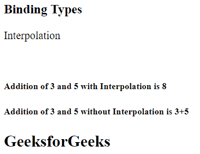
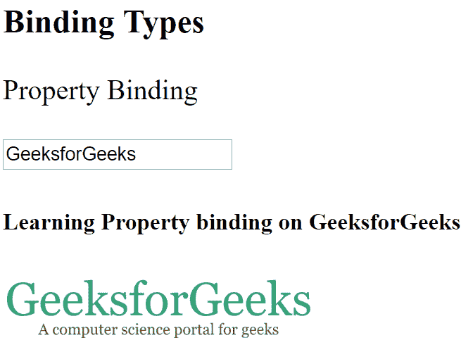
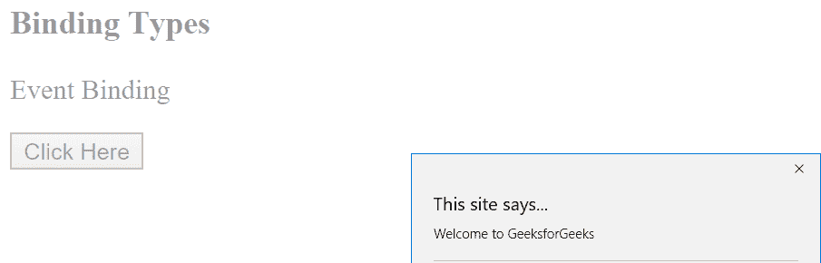
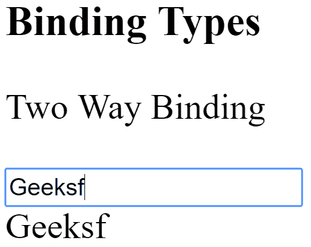

# AngularJS |数据绑定

> 原文:[https://www.geeksforgeeks.org/angularjs-data-binding/](https://www.geeksforgeeks.org/angularjs-data-binding/)

Angular 提供了一个功能[数据绑定](https://docs.angularjs.org/guide/databinding)，它帮助我们几乎实时地反映用户给出的输入，即它在模型和视图之间创建了一个连接。绑定有多种类型，但我们将重点关注-:
1)插值
2)属性绑定
3)事件绑定
4)双向绑定

**[插值](https://docs.angularjs.org/guide/interpolation) :**
角度插值用于使用双花括号语法在相应的视图模板中显示组件属性。插值用于传递组件类中提到的属性，以反映在其模板中。

```
Syntax-: class="{{variable_name}}"

```

例如:
**app.component.html**

```
<h3>Binding Types</h3>
<P>Interpolation</P>
<br>
<h5>Addition of 3 and 5 with Interpolation is {{3+5}}</h5>
<h5>Addition of 3 and 5 without Interpolation is 3+5</h5>
<h2>{{val}}</h2>
```

**app.component.ts**

```
import { Component } from '@angular/core';
@Component({
  selector: 'app-root',
  templateUrl: './app.component.html',
  styleUrls: ['./app.component.css']
})
export class AppComponent {
  val: string;
}
```



 **属性绑定:**类似于 Java，父类中定义的变量可以被子类继承，在这种情况下，子类就是模板。插值和属性绑定的唯一区别是，我们不应该在使用插值时将非字符串值存储在变量中。因此，如果我们必须存储布尔或其他数据类型，而不是使用属性绑定。

```
Syntax-: [class]="variable_name"

```

**app.component.html**

```
<h3>Binding Types</h3>
<p>Property Binding</p>
<input type="text" ng-bind="{{ Geeks }}"><br>
<h5>Learning Property binding on {{ Geeks }}</h5>

```

**app.component.ts**

```
import { Component } from '@angular/core';
@Component({
  selector: 'app-root',
  templateUrl: './app.component.html',
  styleUrls: ['./app.component.css']
})
export class AppComponent {
  title = 'Geeks';
  classtype ="text-danger";
  Geeks= "GeeksforGeeks";
  image="https://media.geeksforgeeks.org
         /wp-content/uploads/geeksforgeeks-6.png";
}
```

输出:


 **事件绑定:**无论何时按下按键或点击鼠标，都会创建一个事件。

语法:

```
  <button class="btn btn-block" (click)=showevent($event)>Event</button> 
showevent(event)
{ 
      alert("Welcome to GeeksforGeeks");   
}  
```

**app.component.html**

```
<h3>Binding Types</h3>
<P>Event Binding</P>
<button class="btn btn-block" (click)="Clickme($event)">
    Click Here
</button>
```

**app.component.ts**

```
import { Component } from '@angular/core';
@Component({
  selector: 'app-root',
  templateUrl: './app.component.html',
  styleUrls: ['./app.component.css']
})
export class AppComponent {
  title = 'Geeks';
  Clickme(event) {
    alert('Welcome to GeeksforGeeks');
   }
}
```

输出:


**双向绑定:**
在 app.module.ts 中，我们必须在导入中包含 FormsModule，就像给定的方式一样，我们也必须导入 FormsModule。我们必须包含 FormsModule，因为 ngModel 不是包含在我们使用新项目名称开发的项目中的属性，所以我们必须通过导入这个 Module 来包含它。

```
import { FormsModule } from '@angular/forms';

  imports: [
    BrowserModule,
    FormsModule,
    AppRoutingModule,
  ],

```

**app.component.html**

```
<h3>Binding Types</h3>
<P>Two Way Binding</P>
<input type="text" placeholder="Enter text" [(ngModel)]="val">
<br>
{{ val }}
```

**app.component.ts**

```
import { Component } from '@angular/core';
@Component({
  selector: 'app-root',
  templateUrl: './app.component.html',
  styleUrls: ['./app.component.css']
})
export class AppComponent {
  val: string;
}
```

输出:
