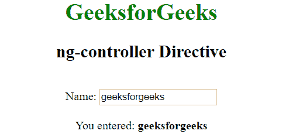

# angolajs |指令

> 原文:[https://www.geeksforgeeks.org/angularjs-directive/](https://www.geeksforgeeks.org/angularjs-directive/)

AngularJS 是一个开源的 MVC 框架，与 JavaScript 框架非常相似。
指令是 DOM 元素上的标记，它告诉 Angular JS 将一个指定的行为附加到该 DOM 元素上，甚至用它的子元素来转换 DOM 元素。简单的 AngularJS 允许用称为指令的新属性扩展 HTML。AngularJS 有一组内置指令，为应用程序提供功能。它还定义了自己的指令。
指令可以使用一些函数来定义，这些函数是:元素名称、属性、类、注释。

**为什么要用？**

*   它支持为不同类型的元素创建自定义指令。
*   当前面有相同的元素或匹配的元素时，指令被激活。
*   它被用来通过帮助他们学习新的语法来赋予 HTML 更多的力量。
*   像组件类一样，指令类可以实现生命周期挂钩来影响它们的配置和行为。

**指令组件:**AngularJS 指令使用前缀 ng-扩展属性。下面讨论一些指令组件:

*   **ng-app:** It is an auto bootstrap AngularJS application which says that all the AngularJS should have a root element.

    **示例:**

    ```ts
    <html> 

    <head> 
        <title>AngularJS ng-app Directive</title> 

        <script src= 
    "https://ajax.googleapis.com/ajax/libs/angularjs/1.6.9/angular.min.js"> 
        </script> 
    </head> 

    <body style="text-align:center"> 

        <h2 style = "color:green">ng-app directive</h2> 

        <div ng-app="" ng-init="name='GeeksforGeeks'"> 
            <p>{{ name }} is the portal for geeks.</p> 
        </div> 
    </body> 

    </html> 
    ```

    **输出:**
    

*   **ng-controller:** The ng-controller Directive in AngularJS is used to add controller to the application. It can be used to add methods, functions, and variables that can be called on some event like a click, etc to perform a certain action.

    **示例:**

    ```ts
    <!DOCTYPE html> 
    <html> 

    <head> 
        <title>ng-controller Directive</title> 

        <script src= 
    "https://ajax.googleapis.com/ajax/libs/angularjs/1.4.2/angular.min.js"> 
        </script> 
    </head> 

    <body ng-app="app" style="text-align:center"> 

        <h1 style="color:green">GeeksforGeeks</h1> 
        <h2>ng-controller Directive</h2><br> 

        <div ng-controller="geek"> 
            Name: <input class="form-control" type="text"
                    ng-model="name"> 
            <br><br> 

            You entered: <b><span>{{name}}</span></b> 
        </div> 

        <script> 
            var app = angular.module('app', []); 
            app.controller('geek', function ($scope) { 
                $scope.name = "geeksforgeeks"; 
            }); 
        </script> 
    </body> 

    </html> 
    ```

    **输出:**
    

*   **ng-bind:** It is used to bind/replace the text content of a particular element with the value that is entered in the given expression. The value of specified HTML content updates whenever the value of the expression changes in the ng-bind directive.

    **示例:**

    ```ts
    <!DOCTYPE html> 
    <html> 

    <head> 
        <title>ng-checked Directive</title> 

        <script src= 
    "https://ajax.googleapis.com/ajax/libs/angularjs/1.6.9/angular.min.js"> 
        </script> 
    </head> 

    <body ng-app="gfg" style="text-align:center"> 

        <h1 style="color:green">GeeksforGeeks</h1> 
        <h2>ng-bind Directive</h2>         

        <div ng-controller="app"> 
            num1: <input type="number" ng-model="num1"
                    ng-change="product()" /> 
            <br><br> 

            num2: <input type="number" ng-model="num2"
                    ng-change="product()" /> 
            <br><br> 

            <b>Product:</b> <span ng-bind="result"></span> 
        </div> 

        <script> 
            var app = angular.module("gfg", []); 
            app.controller('app', ['$scope', function ($app) { 
                $app.num1 = 1; 
                $app.num2 = 1; 
                $app.product = function () { 
                    $app.result = ($app.num1 * $app.num2); 
                } 
            }]); 
        </script> 
    </body> 

    </html> 
    ```

    **输出:**
    

**AngularJS 指令的优势:**

*   指令有助于创建重复和独立的代码。
*   他们通过将需求特定的行为函数集中在一个地方来模块化代码。它不会在中央控制器中创建对象，也不会使用多种 JavaScript 方法来操作它们。
*   这种类型的模块化代码将有多个指令，可以处理自己的功能和数据，并且工作应该与其他指令隔离。
*   一个额外的好处是，HTML 页面和 Angular 脚本变得不那么凌乱，更有条理。