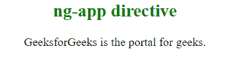

# AngularJS 指令完整参考

> 原文:[https://www . geeksforgeeks . org/angular js-指令-完整-参考/](https://www.geeksforgeeks.org/angularjs-directives-complete-reference/)


指令是文档对象模型(DOM)中的标记。指令可以与任何控制器或 HTML 标记一起使用，这些标记将告诉编译器预期的确切操作或行为。存在一些预定义的指令，但是如果开发人员需要，他可以创建新的指令(自定义指令)。

**示例:** 本示例使用 ng-app 指令定义默认 AngularJS 应用程序。

```ts
<html>        
<head> 
    <title>AngularJS ng-app Directive</title> 
    <script src= 
"https://ajax.googleapis.com/ajax/libs/angularjs/1.6.9/angular.min.js">
    </script> 
</head> 
<body style="text-align:center"> 

    <h2 style = "color:green">ng-app directive</h2> 
    <div ng-app="" ng-init="name='GeeksforGeeks'"> 
        <p>{{ name }} is the portal for geeks.</p>
    </div> 
</body>   
</html> 
```

**输出:**



下表列出了重要的内置 AngularJS 指令。

| 指令 | 描述 |
| ng 应用程序 | AngularJS 应用程序的开始。 |
| k-init | 用于初始化变量 |
| ng 模型 | ng-model 用于绑定到 HTML 控件 |
| ng-控制器 | 将控制器附着到视图 |
| 我的天啊 | 将该值与 HTML 元素绑定 |
| ng 重复 | 对指定集合中的每个项目重复一次 HTML 模板。 |
| ng 显示 | 显示或隐藏关联的 HTML 元素 |
| ng-只读 | 将 HTML 元素设为只读 |
| ng-禁用 | 用于动态禁用或启用按钮 |
| ng-if | 移除或重新创建 HTML 元素 |
| ng 点击 | 点击自定义步骤 |

**指令:**

*   [angolajs |准则](https://www.geeksforgeeks.org/angularjs-directives/)
*   [AngularJS | ng-list 指令](https://www.geeksforgeeks.org/angularjs-ng-list-directive/)
*   [禁用角度指令](https://www.geeksforgeeks.org/angularjs-ng-disabled-directive/)
*   [angolajs | ng-mouseup 指令](https://www..geeksforgeeks.org/angularjs-ng-mouseup-directive/)
*   [角联| ng-keyup 指令](https://www.geeksforgeeks.org/angularjs-ng-keyup-directive/)
*   [角度聚焦指令](https://www.geeksforgeeks.org/angularjs-ng-focus-directive/)
*   [angolajs | ng-keypress 指令](https://www.geeksforgeeks.org/angularjs-ng-keypress-directive/)
*   [角度指令|隐藏指令](https://www.geeksforgeeks.org/angularjs-ng-hide-directive/)
*   [angolajs | ng-dbl click 指令](https://www.geeksforgeeks.org/angularjs-ng-dblclick-directive/)
*   [angolajs | ng-mousedown 指令](https://www.geeksforgeeks.org/angularjs-ng-mousedown-directive/)
*   [AngularJS | ng-变更指令](https://www.geeksforgeeks.org/angularjs-ng-change-directive/)
*   [角度 JS | ng-maxlength 指令](https://www.geeksforgeeks.org/angularjs-ng-maxlength-directive/)
*   [角度模糊指令](https://www.geeksforgeeks.org/angularjs-ng-blur-directive/)
*   [角度控制器指令](https://www.geeksforgeeks.org/angularjs-ng-controller-directive/)
*   [angolajs | ng-moueleve 指令](https://www.geeksforgeeks.org/angularjs-ng-mouseleave-directive/)
*   [角度约束指令](https://www.geeksforgeeks.org/angularjs-ng-bind-directive/)
*   [角联| ng-mouseter 指令](https://www.geeksforgeeks.org/angularjs-ng-mouseenter-directive/)
*   [点击指令](https://www.geeksforgeeks.org/angularjs-ng-click-directive/)
*   [AngularJS | ng-copy 指令](https://www.geeksforgeeks.org/angularjs-ng-copy-directive/)
*   [角联| ng-mousemove 指令](https://www.geeksforgeeks.org/angularjs-ng-mousemove-directive/)
*   [角度 JS | ng-minlength 指令](https://www.geeksforgeeks.org/angularjs-ng-minlength-directive/)
*   [角度检查指令](https://www.geeksforgeeks.org/angularjs-ng-checked-directive/)
*   [AngularJS | ng-if 指令](https://www.geeksforgeeks.org/angularjs-ng-if-directive/)
*   [角度切割指令](https://www.geeksforgeeks.org/angularjs-ng-cut-directive/)
*   [AngularJS | ng-只读指令](https://www.geeksforgeeks.org/angularjs-ng-readonly-directive/)
*   [angolajs | textarea 指令](https://www.geeksforgeeks.org/angularjs-textarea-directive/)
*   [AngularJS |输入指令](https://www.geeksforgeeks.org/angularjs-input-directive/)
*   [AngularJS | ng-包括指令](https://www.geeksforgeeks.org/angularjs-ng-include-directive/)
*   [angolajs | ng-jq 指令](https://www.geeksforgeeks.org/angularjs-ng-jq-directive/)
*   [AngularJS | ng-型号指令](https://www.geeksforgeeks.org/angularjs-ng-model-directive/)
*   [AngularJS | ng-transclude 指令](https://www.geeksforgeeks.org/angularjs-ng-transclude-directive/)
*   [AngularJS | ng 级偶数指令](https://www.geeksforgeeks.org/angularjs-ng-class-even-directive/)
*   [AngularJS | ng-class-奇数指令](https://www.geeksforgeeks.org/angularjs-ng-class-odd-directive/)
*   [AngularJS | ng 值指令](https://www.geeksforgeeks.org/angularjs-ng-value-directive/)
*   [AngularJS | ng-bind-模板指令](https://www.geeksforgeeks.org/angularjs-ng-bind-template-directive/)
*   [AngularJS | ng 形式指令](https://www.geeksforgeeks.org/angularjs-ng-form-directive/)
*   [angolajs | ng-bind-html 指令](https://www.geeksforgeeks.org/angularjs-ng-bind-html-directive/)
*   [AngularJS | ng 级指令](https://www.geeksforgeeks.org/angularjs-ng-class-directive/)
*   [AngularJS | ng-复数指令](https://www.geeksforgeeks.org/angularjs-ng-pluralize-directive/)
*   [角度模式指令](https://www.geeksforgeeks.org/angularjs-ng-pattern-directive/)
*   [AngularJS | ng 型指令](https://www.geeksforgeeks.org/angularjs-ng-style-directive/)
*   [角度开关指令](https://www.geeksforgeeks.org/angularjs-ng-switch-directive/)
*   [AngularJS | ng-show 指令](https://www.geeksforgeeks.org/angularjs-ng-show-directive/)
*   [angolajs | ng-srcet 指令](https://www.geeksforgeeks.org/angularjs-ng-srcset-directive/)
*   [angolajs | ng-src 指令](https://www.geeksforgeeks.org/angularjs-ng-src-directive/)
*   [AngularJS | ng-提交指令](https://www.geeksforgeeks.org/angularjs-ng-submit-directive/)
*   [angolajs | ng-app 指令](https://www.geeksforgeeks.org/angularjs-ng-app-directive/)
*   [angolajs | ng-href 指令](https://www.geeksforgeeks.org/angularjs-ng-href-directive/)
*   [AngularJS | ng-必需指令](https://www.geeksforgeeks.org/angularjs-ng-required-directive/)
*   [angolajs | ng-init 指令](https://www.geeksforgeeks.org/angularjs-ng-init-directive/)
*   [AngularJS | ng-粘贴指令](https://www.geeksforgeeks.org/angularjs-ng-paste-directive/)
*   [AngularJS | ng-open 指令](https://www.geeksforgeeks.org/angularjs-ng-open-directive/)
*   [AngularJS | ng-选项指令](https://www.geeksforgeeks.org/angularjs-ng-options-directive/)
*   [角度选择指令](https://www.geeksforgeeks.org/angularjs-ng-selected-directive/)
*   [不可装订指令](https://www.geeksforgeeks.org/angularjs-ng-non-bindable-directive/)