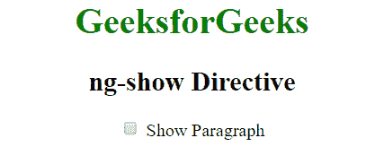

# angolajs |准则

> 哎哎哎:# t0]https://www . geeksforgeeks . org/angolajs-guidelines/

指令是文档对象模型中的标记。指令可以与任何控制器或 HTML 标记一起使用，这些标记将告诉编译器预期的确切操作或行为。存在一些预定义的指令，但是如果开发人员需要，他可以创建新的指令(自定义指令)。

下表列出了重要的内置 AngularJS 指令。

| 指令 | 描述 |
| ng 应用程序 | AngularJS 应用程序的开始。 |
| k-init | 用于初始化变量 |
| ng 模型 | ng-model 用于绑定到 HTML 控件 |
| ng-控制器 | 将控制器附着到视图 |
| 我的天啊 | 将该值与 HTML 元素绑定 |
| ng 重复 | 对指定集合中的每个项目重复一次 HTML 模板。 |
| ng 显示 | 显示或隐藏关联的 HTML 元素 |
| ng-只读 | 将 HTML 元素设为只读 |
| ng-禁用 | 用于动态禁用或启用按钮 |
| ng-if | 移除或重新创建 HTML 元素 |
| ng 点击 | 点击自定义步骤 |

1.  **[ng-app:](https://www.geeksforgeeks.org/angularjs-ng-app-directive/)** The **ng-app Directive** in AngularJS is used to define the root element of an AngularJS application. This directive automatically initializes the AngularJS application on page load. It can be used to load various modules in AngularJS Application.
    **Example:** This example uses ng-app Directive to define a default AngularJS application.

    ```ts
    <html> 

    <head> 
        <title>AngularJS ng-app Directive</title> 

        <script src= 
    "https://ajax.googleapis.com/ajax/libs/angularjs/1.6.9/angular.min.js"> 
        </script> 
    </head> 

    <body style="text-align:center"> 

        <h2 style = "color:green">ng-app directive</h2> 

        <div ng-app="" ng-init="name='GeeksforGeeks'"> 
            <p>{{ name }} is the portal for geeks.</p> 
        </div> 
    </body> 

    </html> 
    ```

    **输出:**
    

2.  **[ng-init:](https://www.geeksforgeeks.org/angularjs-ng-init-directive/)**
    The ng-init directive is used to initialize an AngularJS Application data. It defines the initial value for an AngularJS application and assigns values to the variables.
    The ng-init directive defines initial values and variables for an AngularJS application.
    **Example:** In this example, we initialize an array of string.

    ```ts
    <html> 
        <script src="https://ajax.googleapis.com/ajax/libs/angularjs/1.6.9/ 
        angular.min.js"></script> 
        <head> 
            <title>AngularJS ng-init Directive</title> 
        </head> 
        <body> 
                <h1 style = "color:green">GeeksforGeeks 
                <h2>ng-init directive</h2> 
                <div ng-app="" ng-init="sort=['quick sort', 'merge sort', 
                 'bubble sort']"> 
                 Sorting techniques: 
                <ul> 
                <li>{{ sort[0] }} </li> 
                <li>{{ sort[1] }} </li> 
                <li>{{ sort[2] }} </li> 
                </ul> 
             </div> 
        </body> 
    </html> 
    ```

    **输出:**
    

3.  **[ng-model:](https://www.geeksforgeeks.org/angularjs-ng-model-directive/)**
    ng model 是一个指令，它绑定了输入、选择和 textarea，并将所需的用户值存储在一个变量中，我们可以在任何需要该值的时候使用该变量。
    它也用于表单验证期间。
    **例:**

```ts
<!DOCTYPE html> 
<html> 
<script src= 
"https://ajax.googleapis.com/ajax/libs/angularjs/1.6.9/angular.min.js"> 
</script> 
<style> 
    .column { 
        float: left; 
        text-align: left; 
        width: 49%; 
    } 

    .row { 
        content: ""; 
        display: table; 
    } 
</style> 

<body ng-app="myApp"
    ng-controller="myController"> 
    <h4>Input Box-</h4> 
    <div class="row"> 
        <div class="column"> 
            Name- 
            <input type="text"
                ng-model="name"> 
            <pre> {{ name }} </pre> Checkbox- 
            <input type="checkbox"
                ng-model="check"> 
            <pre> {{ check }} </pre> Radiobox- 
            <input type="radio"
                ng-model="choice"> 
            <pre> {{ choice }} </pre> Number- 
            <input type="number"
                ng-model="num"> 
            <pre> {{ num }} </pre> Email- 
            <input type="email"
                ng-model="mail"> 
            <pre> {{ mail }} </pre> Url- 
            <input type="url"
                ng-model="url"> 
            <pre> {{ url }} </pre> 
        </div> 
        <div class="column"> 
            Date: 
            <input type="date" ng-model="date1" (change)="log(date1)"> 
            <pre> Todays date:{{ date1+1 }}</pre> Datetime-local- 
            <input type="datetime-local" ng-model="date2"> 
            <pre> {{ date2+1 }} </pre> Time- 
            <input type="time" ng-model="time1"> 
            <pre> {{ time1+1 }} </pre> Month- 
            <input type="month" ng-model="mon"> 
            <pre> {{ mon+1 }} </pre> Week- 
            <input type="week" ng-model="we"> 
            <pre> {{ we+1 }} </pre> 
        </div> 
    </div> 
</body> 
<script> 
    var app = angular.module('myApp', []); 
    app.controller('myController', function($scope) { 
        $scope.name = "Hello Geeks!"; 
        $scope.check = ""; 
        $scope.rad = ""; 
        $scope.num = ""; 
        $scope.mail = ""; 
        $scope.url = ""; 
        $scope.date1 = ""; 
        $scope.date2 = ""; 
        $scope.time1 = ""; 
        $scope.mon = ""; 
        $scope.we = ""; 
        $scope.choice = ""; 
        $scope.c = function() { 
        $scope.choice = true; 
        }; 
    }); 
</script> 

</html> 
```

**输出:**


8.  **[ng-controller:](https://www.geeksforgeeks.org/angularjs-ng-controller-directive/)**
    The ng-controller Directive in AngularJS is used to add controller to the application. It can be used to add methods, functions and variables that can be called on some event like click, etc to perform certain action.
    **Example:**

    ```ts
    <!DOCTYPE html> 
    <html> 

    <head> 
        <title>ng-controller Directive</title> 

        <script src= 
    "https://ajax.googleapis.com/ajax/libs/angularjs/1.4.2/angular.min.js"> 
        </script> 
    </head> 

    <body ng-app="app" style="text-align:center"> 

        <h1 style="color:green">GeeksforGeeks</h1> 
        <h2>ng-controller Directive</h2><br> 

        <div ng-controller="geek"> 
            Name: <input class="form-control" type="text"
                    ng-model="name"> 
            <br><br> 

            You entered: <b><span>{{name}}</span></b> 
        </div> 

        <script> 
            var app = angular.module('app', []); 
            app.controller('geek', function ($scope) { 
                $scope.name = "geeksforgeeks"; 
            }); 
        </script> 
    </body> 

    </html> 
    ```

    **输出:**
    

9.  **[ng-bind:](https://www.geeksforgeeks.org/angularjs-ng-bind-directive/)**
    The ng-bind directive in AngularJS is used to bind/replace the text content of any particular HTML element with the value that is entered in the given expression. The value of specified HTML content updates whenever the value of the expression changes in **ng-bind** directive.

    ```ts
    <!DOCTYPE html> 
    <html> 

    <head> 
        <title>ng-checked Directive</title> 

        <script src= 
    "https://ajax.googleapis.com/ajax/libs/angularjs/1.6.9/angular.min.js"> 
        </script> 
    </head> 

    <body ng-app="gfg" style="text-align:center"> 

        <h1 style="color:green">GeeksforGeeks</h1> 
        <h2>ng-bind Directive</h2>         

        <div ng-controller="app"> 
            num1: <input type="number" ng-model="num1"
                    ng-change="product()" /> 
            <br><br> 

            num2: <input type="number" ng-model="num2"
                    ng-change="product()" /> 
            <br><br> 

            <b>Product:</b> <span ng-bind="result"></span> 
        </div> 

        <script> 
            var app = angular.module("gfg", []); 
            app.controller('app', ['$scope', function ($app) { 
                $app.num1 = 1; 
                $app.num2 = 1; 
                $app.product = function () { 
                    $app.result = ($app.num1 * $app.num2); 
                } 
            }]); 
        </script> 
    </body> 

    </html> 
    ```

    

10.  **[ng-repeat:](https://www.geeksforgeeks.org/angular-js-ng-repeat-directive/)**
    Angular-JS ng-repeat directive is a handy tool to repeat a set of HTML code for a number of times or once per item in a collection of items. ng-repeat is mostly used on arrays and objects.
    ng-repeat is similar to a loop that we have in C, C++ or other languages but technically it instantiates a template(normally a set of HTML structures) for each element in a collection that we are accessing. Angular maintains a $index variable as a key to the element which is currently being accessed and the user can also access this variable.

    **示例:**

    1.  Create an app.js file for the app.

        ```ts
        var app = angular.module('myApp',[]); 

        app.controller('MainCtrl', function($scope){ 
            $scope.names = ['Adam','Steve','George','James','Armin']; 
            console.log($scope.names); 
        }); 
        ```

        **第 1 行-** 创建了一个名为“myApp”的应用模块，没有依赖关系。
        **3 号线-** 主控制器供我们应用。
        **第 4 行-** 字符串“名称”数组。

    2.  Create index.html page

        ```ts
        <!DOCTYPE html> 
        <html ng-app="myApp"> 
        <head> 
            <title>Angular ng-repeat</title> 
            <script> type="text/javascript" src="jquery-3.2.1.min.js"> 
            </script> 
            <script> type="text/javascript" src="angular.js"></script> 
            <script> type="text/javascript" src="app.js"></script> 
        </head> 
        <body ng-controller="MainCtrl"> 
            <h2>Here is the name list</h2> 
            <ul> 
                <li ng-repeat="name in names"> 
                    {{name}} 
                </li> 
            </ul> 
        </body> 
        </html> 
        ```

        **第 5 行-** 包含所有依赖项，如 jquery、angular-js 和 app.js 文件
        **第 12 行-** 使用 ng-repeat 指令一次从 names 数组中获取一个名称并显示。
        **输出:**
        

*   **[ng-show:](https://www.geeksforgeeks.org/angularjs-ng-show-directive/)**
    The ng-show Directive in AngluarJS is used to show or hide the specified HTML element. If the given expression in ng-show attribute is true then the HTML element will display otherwise it hides the HTML element. It is supported by all HTML elements.
    **Example 1:** This example uses ng-show Directive to display the HTML element after checked the checkbox.

    ```ts
    <!DOCTYPE html> 
    <html> 

    <head> 
        <title>ng-show Directive</title> 

        <script src= 
    "https://ajax.googleapis.com/ajax/libs/angularjs/1.6.9/angular.min.js"> 
        </script> 
    </head> 

    <body> 
        <div ng-app="app" ng-controller="geek"> 

            <h1 style="color:green">GeeksforGeeks</h1> 
            <h2>ng-show Directive</h2> 

            <input id="chshow" type="checkbox" ng-model="show" /> 

            <label for="chshow"> 
                Show Paragraph 
            </label> 

            <p ng-show="show" style="background: green; color: white; 
                    font-size: 14px; width:35%; padding: 10px;"> 
                Show this paragraph using ng-show 
            </p> 
        </div> 

        <script> 
            var myapp = angular.module("app", []); 
            myapp.controller("geek", function ($scope) { 
                $scope.show = false; 
            }); 
        </script> 
    </body> 

    </html>                     
    ```

    **输出:**
    **之前勾选了复选框:**
    
    **之后勾选了复选框:**
    

    *   **[ng-readonly:](https://www.geeksforgeeks.org/angularjs-ng-readonly-directive/)**
    The ng-readonly Directive in AngularJS is used to specify the readonly attribute of an HTML element. The HTML element will be readonly only if the expression inside ng-readonly directive returns true.
    **Example:** This example uses ng-readonly Directive to enable readonly property.

    ```ts
    <!DOCTYPE html> 
    <html> 
        <head> 
            <title>ng-readonly Directive</title> 

            <script src= 
    "https://ajax.googleapis.com/ajax/libs/angularjs/1.4.2/angular.min.js"> 
            </script> 
        </head> 

        <body ng-app style="text-align:center"> 
            <h1 style="color:green">GeeksforGeeks</h1> 
            <h2>ng-readonly Directive</h2> 

            <div> 
                <label>Check to make month readonly: <input type="checkbox"
                ng-model="open"></label> 

                <br><br> 

                Input Month:<input ng-readonly="open" type="month"
                        ng-model="month"> 
            </div> 
        </body> 
    </html>                     
    ```

    **输出:**
    **之前勾选了复选框:**
    
    **之后勾选了复选框:**
    

    *   **[ng-disabled:](https://www.geeksforgeeks.org/angularjs-ng-disabled-directive/)**
    The ng-disabled Directive in AngularJS is used to enable or disable HTML elements. If the expression inside the ng-disabled attribute returns true then the form field will be disabled or vice versa. It is usually applied on form field (input, select, button, etc).
    **Example 1:** This example uses ng-disabled Directive to disable the button.

    ```ts
    <!DOCTYPE html> 
    <html> 

    <head> 
        <title>ng-disabled Directive</title> 

        <script src= 
    "https://ajax.googleapis.com/ajax/libs/angularjs/1.6.9/angular.min.js"> 
        </script> 
    </head> 

    <body ng-app="app" style="text-align:center"> 

        <h1 style="color:green">GeeksforGeeks</h1> 

        <h2>ng-disabled Directive</h2> 

        <div ng-controller="app" ng-init="disable=false"> 
            <button ng-click="geek(disable)" ng-disabled="disable"> 
                Click to Disable 
            </button> 

            <button ng-click="geek(disable)" ng-show="disable"> 
                Click to Enable 
            </button> 
        </div> 

        <script> 
            var app = angular.module("app", []); 
            app.controller('app', ['$scope', function ($app) { 
                $app.geek = function (disable) { 
                    $app.disable = !disable; 
                } 
            }]); 
        </script> 
    </body> 

    </html> 
    ```

    **输出:**
    **点击按钮前:**
    
    **点击按钮后:**
    

    *   **[ng-if:](https://www.geeksforgeeks.org/angularjs-ng-if-directive/)**
    The ng-if Directive in AngularJS is used to remove or recreate a portion of HTML element based on an expression. The ng-if is different from ng-hide because it completely removes the element in the DOM rather than just hiding the display of the element. If the expression inside it is false then the element is removed and if it is true then the element is added to the DOM.
    **Example:** This example changes the content after clicking the button.

    ```ts
    <!DOCTYPE html> 
    <html> 

    <head> 
        <title>ng-hide Directive</title> 

        <script src= 
    "https://ajax.googleapis.com/ajax/libs/angularjs/1.6.9/angular.min.js"> 
        </script> 
    </head> 

    <body ng-app="geek" style="text-align:center"> 

        <h1 style="color:green"> 
            GeeksforGeeks 
        </h1> 

        <h2>ng-if Directive</h2> 

        <div ng-controller="app as vm"> 
            <div ng-if="!vm.IsShow"> 
                <input type="button" class="btn btn-primary"
                        ng-click="vm.IsShow=!vm.IsShow"
                        value="Sign in"> 

                <p>Click to Sign in</p> 
            </div> 

            <div ng-if="vm.IsShow"> 
                <button class="btn btn-primary"
                ng-click="vm.IsShow=!vm.IsShow"> 
                    Sign out 
                </button> 

                <p> 
                    GeeksforGeeks is the computer 
                    science portal for geeks. 
                </p> 
            </div> 
        </div> 

        <script> 
            var app = angular.module("geek", []); 
            app.controller('app', ['$scope', function ($scope) { 
                var vm = this; 
            }]); 
        </script> 
    </body> 

    </html> 
    ```

    **输出:
    点击按钮前:**
    
    **点击按钮后:**
    

    *   **[ng-click:](https://www.geeksforgeeks.org/angularjs-ng-click-directive/)**
    The ng-click Directive in AngluarJS is used to apply custom behavior when an element is clicked. It can be used to show/hide some element or it can popup alert when button is clicked.
    **Example:** This example uses ng-click Directive to display an alert message after clicking the element.

    ```ts
    <!DOCTYPE html> 
    <html> 

    <head> 
        <title>ng-click Directive</title> 

        <script src= 
    "https://ajax.googleapis.com/ajax/libs/angularjs/1.6.9/angular.min.js"> 
        </script> 
    </head> 

    <body ng-app="geek" style="text-align:center"> 

        <h1 style="color:green">GeeksforGeeks</h1> 
        <h2>ng-click Directive</h2> 

        <div ng-controller="app"> 
            <button> 
                <a href="" ng-click="alert()"> 
                    Click Here 
                </a> 
            </button> 
        </div> 

        <script> 
            var app = angular.module("geek", []); 
            app.controller('app', ['$scope', function ($app) { 
                $app.alert = function () { 
                    alert("This is an example of ng-click"); 
                } 
            }]); 
        </script> 
    </body> 

    </html> 
    ```

    **输出:**
    **点击按钮前:**
    
    **点击按钮后:**
    