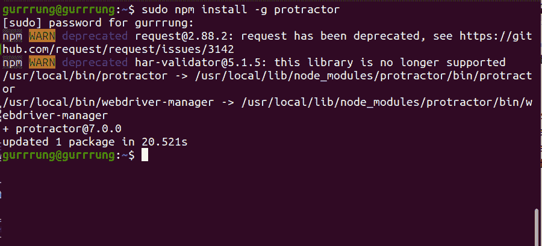
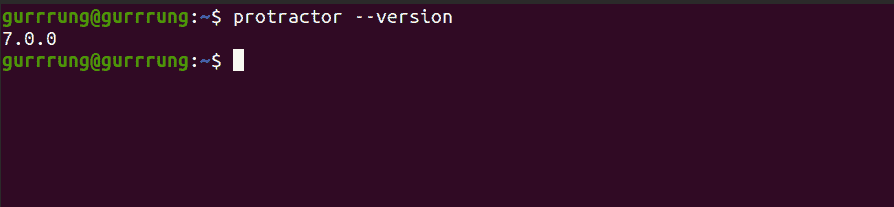
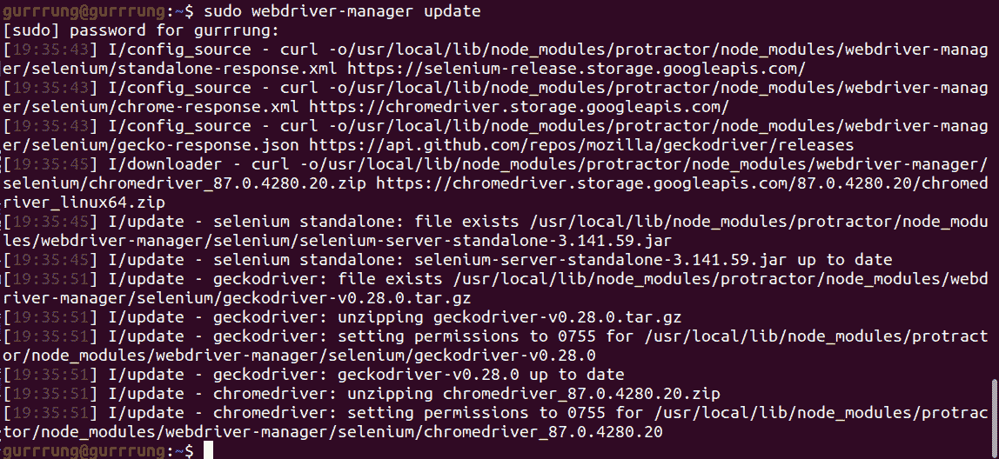
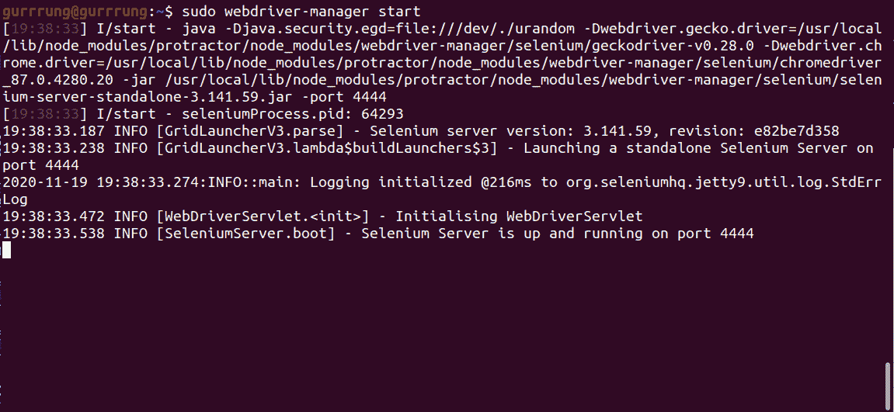
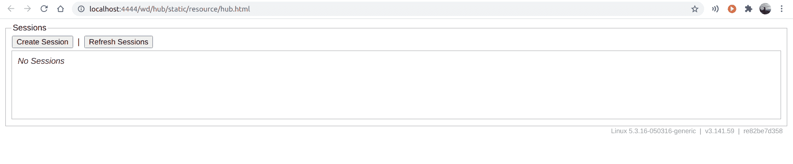

# 角度端到端(E2E)测试量角器|安装和设置

> 原文:[https://www . geeksforgeeks . org/angular js-端到端-e2e-测试-量角器-安装和设置/](https://www.geeksforgeeks.org/angularjs-end-to-end-e2e-testing-protractor-installation-and-setup/)

量角器是为 Angular 和 AngularJS 应用开发的端到端测试框架。它像一个真正的用户一样，在一个真正的浏览器中运行与它交互的应用程序。

**特征:**

*   **使用浏览器的测试:**量角器使用本机事件和特定于浏览器的驱动程序与应用程序交互。
*   **为角度而造:**量角器是为角度而造的，因此支撑力惊人。
*   **自动等待:**您不再需要在测试中添加等待和睡眠。当网页完成未完成的任务时，量角器会自动执行测试的下一步，因此您不必等待测试和网页同步。

**安装:**

**1。**量角器可以使用下面给出的命令在节点上全局安装:

```
// For Windows
npm install -g protractor

// For Linux
sudo npm install -g protractor
```

**注意:**对于 Ubuntu 中的用户，需要在所有给定的命令中添加 **sudo** 来获得权限。


**2。**现在检查安装是否成功，让我们使用下面给出的命令检查量角器的版本:

```
protractor --version
```


**3。**上面截图说版本是 7.0.0，说明安装成功。

**设置:**现在安装后我们有两个命令可用，分别是**和 ***网络驱动管理器*** 。 ***网络驱动程序管理器*** 是一个帮助工具，可以轻松获得一个运行的硒服务器实例。现在需要遵循两个步骤:**

****4。更新二进制文件:**我们可以使用下面的命令更新必要的二进制文件。**

```
// For Windows
webdriver-manager update

// For Linux
sudo webdriver-manager update
```

**
**5。启动服务器:**之后，我们可以使用下面的命令运行 Selenium Server。**

```
// For Windows
webdriver-manager start

// For Linux
sudo webdriver-manager start
```

**
**6。**之后，您可以通过[http://localhost:4444/wd/hub](http://localhost:4444/wd/hub)访问服务器。**

****