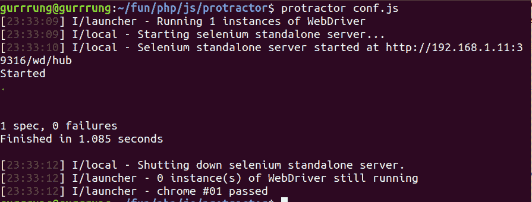

# 角度传感器端到端(E2E)测试|量角器

> 原文:[https://www . geeksforgeeks . org/angular js-端到端-e2e-测试-量角器/](https://www.geeksforgeeks.org/angularjs-end-to-end-e2e-testing-protractor/)

**量角器**是为 Angular 和 AngularJS 应用开发的端到端测试框架。它像一个真正的用户一样，在一个真正的浏览器中运行与它交互的应用程序。在本文中，我们将创建一个基本测试。

**先决条件:**量角器的安装和设置

**进场:**

*   我们将创建一个基本的测试程序，在其中我们将检查 Angular 网络应用程序的标题是否正确。
*   所有量角器测试都将有一个包含配置的文件，这将是启动测试的初始文件。
*   让我们用名称 **conf.js** 创建这个文件。

conf . js:t1]

## java 描述语言

```
exports.config = {

    // Capabilities to be passed to the 
    // webdriver instance.
    // Here we are specifying the browser
    // to be chrome
    capabilities: {
        'browserName': 'chrome'
    },

    // Framework to use. Jasmine is
    // being used here.
    framework: 'jasmine',

    // The test file which are relative
    // to the current working directory
    // when protractor is called.
    specs: ['test.js'],

    // Options to be passed to Jasmine.
    jasmineNodeOpts: {
        defaultTimeoutInterval: 30000
    }
};
```

*   现在让我们创建我们的测试文件 **test.js** 。在这个文件中，我们将访问一个 AngularJS 网络应用程序，然后检查标题是否正确。
*   浏览器是量角器创建的全局，用于浏览器级命令，如使用**浏览器导航，获取**。
*   **描述**和 **it** 的语法来自 Jasmine 框架，其中**描述**是对您的测试的描述，而 **it** 是测试的步骤。

名为 **test.js:** 的规范文件

## java 描述语言

```
describe('Protractor Demo App', function () {
    it('should have a title', function () {

        // Open the AngularJS webpage
        browser.get(
    'http://juliemr.github.io/protractor-demo/');

        // Check if the title is 'Super
        //  Calculator' or not.
        expect(browser.getTitle())
            .toEqual('Super Calculator');
    });
});
```

*   最后，我们准备使用下面给出的命令运行我们的文件:

    ```
    protractor conf.js
    ```

*   This will run the configuration file and the test will be run as shown in the screenshot below:

    **输出:**

    