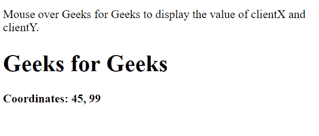
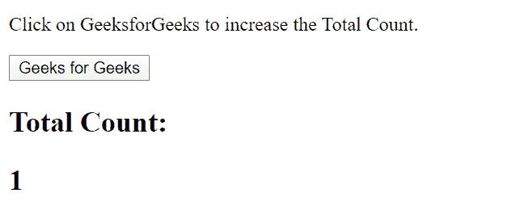

# AngularJS |事件

> 原文:[https://www.geeksforgeeks.org/angularjs-events/](https://www.geeksforgeeks.org/angularjs-events/)

可以使用下面提到的指令添加 AngularJS 中的事件:

*   **[ng-mousemove:](https://www.geeksforgeeks.org/angularjs-ng-mousemove-directive/)** 鼠标的移动导致事件的执行。
*   **[ng-mouseup:](https://www.geeksforgeeks.org/angularjs-ng-mouseup-directive/)** 鼠标向上移动导致事件执行。
*   **[ng-mousedown:](https://www.geeksforgeeks.org/angularjs-ng-mousedown-directive/)** 鼠标向下移动导致事件执行。
*   **[ng-mouseenter:](https://www.geeksforgeeks.org/angularjs-ng-mouseenter-directive/)** 点击鼠标按钮即可执行事件。
*   **[ng-mouseover:](https://www.geeksforgeeks.org/angularjs-ng-mouseover-directive/)** 鼠标悬停导致事件执行。
*   **[ng-cut:](https://www.geeksforgeeks.org/angularjs-ng-cut-directive/)** Cut 操作导致事件的执行。
*   **[ng-copy:](https://www.geeksforgeeks.org/angularjs-ng-copy-directive/)** Copy 操作导致事件的执行。
*   **[按键:](https://www.geeksforgeeks.org/angularjs-ng-keypress-directive/)** 按键导致事件的执行。
*   **[【ng-keyup:](https://www.geeksforgeeks.org/angularjs-ng-keyup-directive/)**按下向上箭头键即可执行事件。
*   **[【ng-keydown:](https://www.geeksforgeeks.org/angularjs-ng-keydown-directive/)**按下向下箭头键导致事件的执行。
*   **[ng-click:](https://www.geeksforgeeks.org/angularjs-ng-click-directive/)** 单击即可执行事件。
*   **[ng-dblclick:](https://www.geeksforgeeks.org/angularjs-ng-dblclick-directive/)** 双击导致事件的执行。

**示例 1:** 显示任何鼠标移动事件发生时的动作。这包括拖动鼠标导致光标在屏幕上移动的事件。

```html
<!DOCTYPE html>
<html>

<head>
    <script src=
"https://ajax.googleapis.com/ajax/libs/angularjs/1.6.9/angular.min.js">
    </script>
</head>

<body>
    <p>
        Move the mouse over GeeksforGeeks
        to increase the Total Count.
    </p>

    <div ng-app="App1" ng-controller="Ctrl1">

        <h1 ng-mousemove="count = count + 1">
            Geeks for Geeks
        </h1>

        <h2>Total Count:</h2>
        <h2>{{ count }}</h2>
    </div>

    <script>
        var app = angular.module('App1', []);
        app.controller('Ctrl1', function ($scope) {
            $scope.count = 0;
        });
    </script>
</body>

</html>
```

**输出:**


**示例 2:** 该示例显示了在鼠标移动事件上调用函数的$事件 obj。这里，$event 对象允许鼠标移动事件的发生。

```html
<!DOCTYPE html>
<html>

<head>
    <script src=
"https://ajax.googleapis.com/ajax/libs/angularjs/1.6.9/angular.min.js">
    </script>
</head>

<body>
    <p>
        Mouse over Geeks for Geeks to display
        the value of clientX and clientY.
    </p>
    <div ng-app="App1" ng-controller="Ctrl1">

        <h1 ng-mousemove="myFunc($event)">
            Geeks for Geeks
        </h1>

        <h4>Coordinates: {{x + ', ' + y}}</h4>
    </div>

    <script>
        var app = angular.module('App1', []);
        app.controller('Ctrl1', function ($scope) {
            $scope.myFunc = function (gfg) {
                $scope.x = gfg.clientX;
                $scope.y = gfg.clientY;
            }
        });
    </script>
</body>

</html>
```

**输出:**



**示例 3:** 本示例显示了**点击**事件正在执行的操作。在这里，鼠标按钮的点击导致一些动作的执行。

```html
<!DOCTYPE html>
<html>

<head>
    <script src=
"https://ajax.googleapis.com/ajax/libs/angularjs/1.6.9/angular.min.js">
    </script>
</head>

<body>
    <p>
        Click on GeeksforGeeks to
        increase the Total Count.
    </p>

    <div ng-app="App1" ng-controller="Ctrl1">

        <button ng-click="count = count + 1">
            Geeks for Geeks
        </button>

        <h2>Total Count:</h2>
        <h2>{{ count }}</h2>
    </div>

    <script>
        var app = angular.module('App1', []);
        app.controller('Ctrl1', function ($scope) {
            $scope.count = 0;
        });
    </script>
</body>

</html>
```

**输出:**

