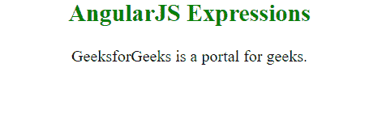
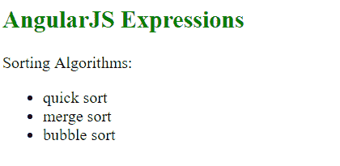

# AngularJS |表达式

> 原文:[https://www.geeksforgeeks.org/angularjs-expressions/](https://www.geeksforgeeks.org/angularjs-expressions/)

AngularJS 中的表达式用于将应用程序数据绑定到 HTML。表达式由 Angular 解析，结果返回到编写表达式的位置。AngularJS 中的表达式是用双大括号写的: **{{ expression }}** 。它们的行为类似于 ng-bind 指令: **ng-bind=“表达式”**。
**语法:**

```
{{ expression }}

```

**示例:**这个示例显示了我们在 ng-init 指令中输入的名称。

```
<!DOCTYPE html>
<html>
    <script src="https://ajax.googleapis.com/ajax/libs/angularjs/1.6.9/
    angular.min.js"></script>
    <head>
        <title>AngularJS Introduction</title>
    </head>
    <body style = "text-align:center">
            <h2 style = "color:green">AngularJS Expressions</h2>
            <div ng-app="" ng-init="name='GeeksforGeeks'">
            <p> {{ name }} is a portal for geeks.</p>
            </div>
    </body>
</html>
```

**输出:**


**示例 2:** 本示例显示了我们在 ng-init 指令中输入的对象的内容。

```
<html>
    <script src="https://ajax.googleapis.com/ajax/libs/angularjs/1.6.9/
    angular.min.js"></script>
    <head>
        <title>AngularJS Introduction</title>
    </head>
    <body>
        <h2 style = "color:green">AngularJS Expressions</h2>
        <div ng-app="" ng-init="sort={one:'quick sort',
        two:'merge sort', three:'bubble
            sort'}">
            <p> Sorting Algorithms:
            <ul>
                <li>{{ sort.one }}</li>
                <li>{{ sort.two }}</li>
                <li>{{ sort.three }}</li>
            </ul>
        </div>
    </body>
</html>
```

**输出:**
