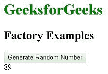
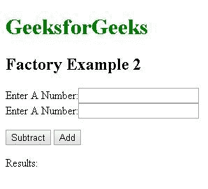
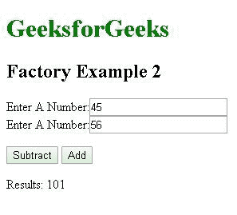

# AngularJS |工厂方法

> 原文:[https://www.geeksforgeeks.org/angularjs-factory-method/](https://www.geeksforgeeks.org/angularjs-factory-method/)

AngularJS 工厂方法使 AngularJS 应用程序的开发过程更加健壮。工厂是一个简单的函数，它允许我们向创建的对象添加一些逻辑并返回创建的对象。工厂还用于以**可重用代码**的形式创建/返回一个函数，该函数可以在应用程序中的任何地方使用。每当我们使用工厂创建一个对象时，它总是返回该对象的一个新实例。工厂返回的对象可以与 Angularjs 框架的不同组件集成(可注入)，例如控制器、服务、过滤器或指令。

**用途:**
在实际场景中，工厂通常充当实现应用程序不同特性的功能集合的容器或类。当与构造函数一起使用时，它可以在不同的控制器中启动。

**语法:**

```
module.factory( 'factoryName', function(){ Custom code....});
```

**示例:**
以下示例说明了在控制器内部实例化工厂代码来生成随机数的用法

```
<!DOCTYPE html>
<html>

<head>
    <title>Factory Example 1</title>

    <script src=
"https://ajax.googleapis.com/ajax/libs/angularjs/1.6.9/angular.min.js">
    </script>
    <script>
        var application = angular.module('myApp', []);

        application.factory('random', function() {
            var randomObject = {};
            var number = Math.floor(Math.random() * 100);
            randomObject.generate = function() {
                return number;
            };
            return randomObject;
        });

        application.controller('thisapp', function($scope, random) {
            $scope.generateRandom = function() {
                $scope.randomNumber = random.generate();
            };
        });
    </script>
</head>

<body>
    <h1 style="color:green">GeeksforGeeks</h1>
    <h2>Factory Examples</h2>
    <div ng-app="myApp" ng-controller="thisapp">
        <button ng-click="generateRandom()">
          Generate Random Number
      </button>
        <br>{{randomNumber}}
    </div>
</body>

</html>
```

**输出:**



点击生成随机数按钮，我们每次得到一个不同的数字。在这个例子中，我们使用工厂方法来定义一个带有变量的函数，并使用数学方法。每次调用这个函数时，我们都会为该变量存储一个随机值。然后在控制器中调用这个函数，控制器的$scope 变量携带被调用函数的随机值，然后我们调用这个控制器到我们的 HTML 代码来显示结果。

**示例:**本示例利用工厂创建一个函数来查找两个数字的加减。然后，这个函数被加载到 controller $scope 变量中，该变量将它们传递给 html 代码以显示结果。

```
<!DOCTYPE html>
<html>

<head>
    <title>Factory Example 2</title>
    <script src=
"https://ajax.googleapis.com/ajax/libs/angularjs/1.6.9/angular.min.js">
    </script>
    <script>
        var application = angular.module('myApp', []);

        application.factory('MyFactoryService', function() {
            var factory = {};
            factory.Subtract = function(a, b) {
                return a - b;
            };
            factory.Add = function(a, b) {
                return a + b;
            };
            return factory;
        });

        application.controller('thisapp', function(
                               $scope, MyFactoryService) {
            $scope.result = function() {
                $scope.results = 
                  MyFactoryService.Subtract($scope.num1, $scope.num2)
            };
            $scope.result2 = function() {
                $scope.results = 
                  MyFactoryService.Add($scope.num1, $scope.num2)
            };
        });
    </script>
</head>

<body>
    <h1 style="color:green">GeeksforGeeks</h1>
    <h2>Factory Example 2</h2>
    <div ng-app="myApp" ng-controller="thisapp">
        <p>
            Enter A Number:
            <input type="number" ng-model="num1" />
            <br/> Enter A Number:
            <input type="number" ng-model="num2" />
            <br/>
        </p>
        <button ng-click="result()">Subtract</button>
        <button ng-click="result2()">Add</button>
        <p>Results: {{results}}
    </div>
</body>

</html>
```

**输出:**
**前:**


**进入输入后点击加减按钮显示结果:**
