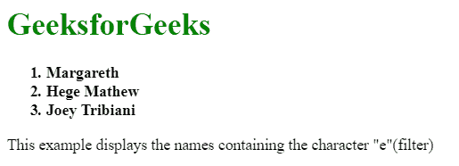
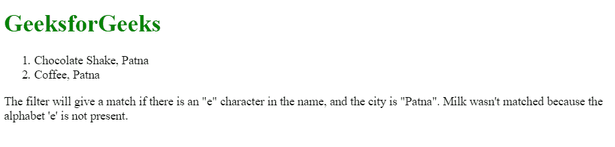
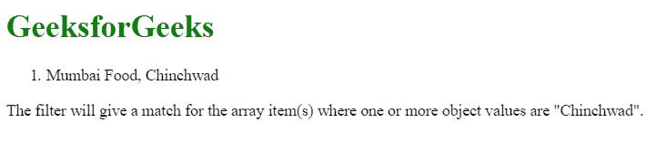

# AngularJS |滤镜滤镜

> 原文:[https://www.geeksforgeeks.org/angularjs-filter-filter/](https://www.geeksforgeeks.org/angularjs-filter-filter/)

AngularJS 中的“过滤器”filter 用于过滤数组和对象元素，并返回过滤后的项目。换句话说，这个过滤器从原始数组中选择一个数组的子集(包含满足过滤标准的元素的较小数组)。

**语法:**

```
{{ arrayexpression | filter : expression : comparator : anyPropertyKey }}

```

**参数:**

*   **数组表达式:**将应用过滤器的源数组。
*   **表达式:**用于在满足过滤条件后，从数组中选择项目。
*   **比较器:**用于通过比较来自过滤器表达式的期望值和来自对象数组的实际值来确定值。
*   **anyPropertyKey:** 它是一个特殊的属性，用于将值与给定的属性进行匹配。它的默认值是$。

**例 1:**

```
<!DOCTYPE html>
<html>

<head>
    <title>AngularJS | filter Filter</title>

    <script src=
"https://ajax.googleapis.com/ajax/libs/angularjs/1.6.9/angular.min.js">
    </script>
</head>

<body>

    <div ng-app="myApp" ng-controller="namesCtrl">

        <h1 style="color:green;">GeeksforGeeks</h1>

        <ol>
            <strong>
                <li ng-repeat="x in names | filter : 'e'">
                    {{ x }}
                </li>
            </strong>
        </ol>
    </div>

    <script>
        angular.module('myApp', []).controller(
                    'namesCtrl', function($scope) {
            $scope.names = [
                'Jani',
                'Carl',
                'Margareth',
                'Hege Mathew',
                'Joey Tribiani',
                'Gustav',
                'Birgit',
                'Mary',
                'Kai'
            ];
        });
    </script>

    <p>
        This example displays the names
        containing the character "e"(filter)
    </p>
</body>

</html>                    
```

**输出:**


**示例 2:** 本示例使用对象来过滤其元素。

```
<!DOCTYPE html>
<html>

<head>
    <title>AngularJS | filter Filter</title>

    <script src=
"https://ajax.googleapis.com/ajax/libs/angularjs/1.6.9/angular.min.js">
    </script>
</head>

<bod>
    <div ng-app="myApp" ng-controller="arrCtrl">

        <h1 style="color:green">GeeksforGeeks</h1>

        <ol>
            <li ng-repeat=
            "x in customers | filter :{'name' : 'e', 'city' : 'Patna'}">
                {{x.name + ", " + x.city}}
            </li>
        </ol>
    </div>

    <script>
        var app = angular.module('myApp', []);

        app.controller('arrCtrl', function($scope) {
            $scope.customers = [{
                "name": "Chocolate Shake",
                "city": "Patna"
            }, {
                "name": "Hot Chocolate",
                "city": "Delhi"
            }, {
                "name": "Milk",
                "city": "Patna"
            }, {
                "name": "Coffee",
                "city": "Patna"
            }, {
                "name": "Tea",
                "city": "Pune"
            }, {
                "name": "Mineral Water",
                "city": "Mumbai"
            }, {
                "name": "Iced Tea",
                "city": "Bangalore"
            }];
        });
    </script>

    <p>
        The filter will give a match if there is
        an "e" character in the name, and the city
        is "Patna". Milk wasn't matched because
        the alphabet 'e' is not present.
    </p>

</body>
</html>                    
```

**输出:**


**示例 3:** 在本例中，我们将看到一个“严格”的 caparison，它不返回任何值，除非它是纯匹配。

```
<!DOCTYPE html>
<html>

<head>
    <title>AngularJS | filter Filter</title>

    <script src=
"https://ajax.googleapis.com/ajax/libs/angularjs/1.6.9/angular.min.js">
    </script>
</head>

<body>

    <div ng-app="myApp" ng-controller="arrCtrl">
        <h1 style="color:green">GeeksforGeeks</h1>

        <ol>
            <li ng-repeat="x in customers | filter : 'Chinchwad' : true">
              {{x.name + ", " + x.city}}
            </li>
        </ol>
    </div>

    <script>
        var app = angular.module('myApp', []);

        app.controller('arrCtrl', function($scope) {
            $scope.customers = [{
                    "name": "Mumbai Food",
                    "city": "Chinchwad"
                }, {
                    "name": "Gurgaon Catering",
                    "city": "Haryana City"
                }, {
                    "name": "Noida temperature",
                    "city": " Chinchwad"
                },

            ];
        });
    </script>

    <p>The filter will give a match for the array item(s) 
       where one or more object values are "Chinchwad".</p>

</body>
</html>                    
```

**输出:**


**注意:**如果注意到数组中的最后一个 Chinchwad 没有包含在列表中，因为最后一个 Chinchwad 的前面包含一个空格。