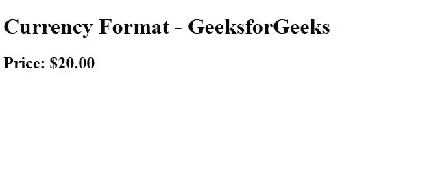
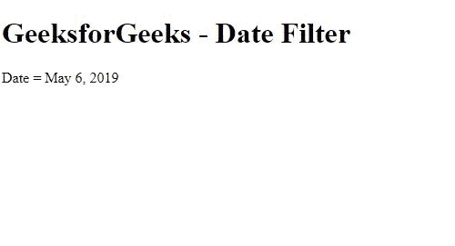
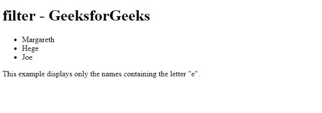
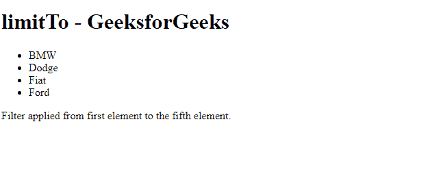
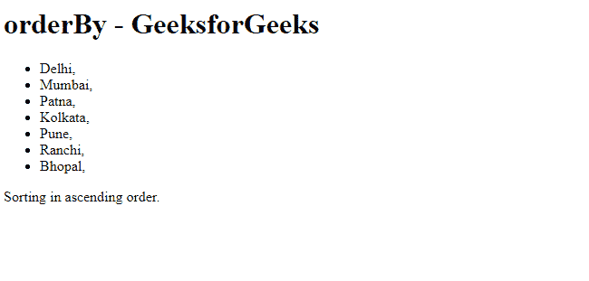
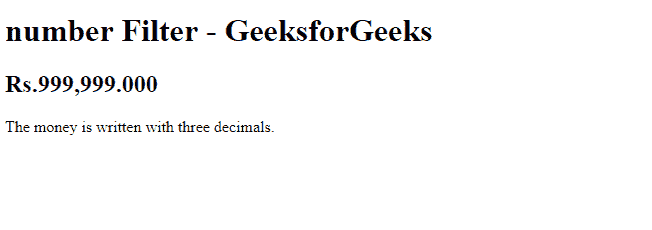
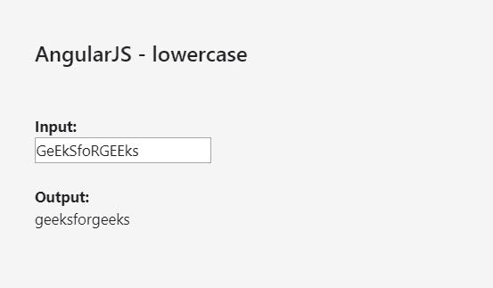
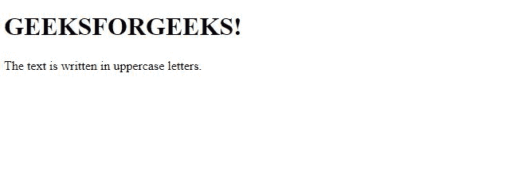
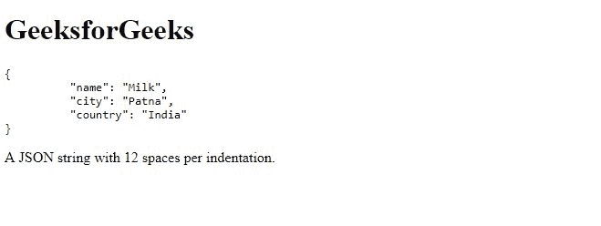
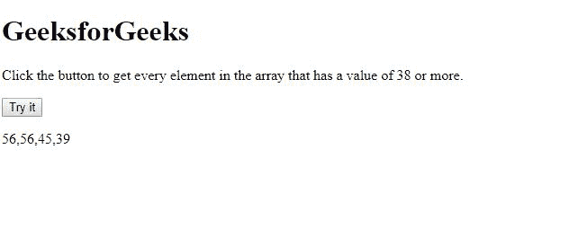

# 角度\过滤器

> 原文:[https://www.geeksforgeeks.org/angularjs-filters/](https://www.geeksforgeeks.org/angularjs-filters/)

在 AngularJS 中添加了一些**过滤器**，以便于格式化和处理数据。AngularJS 中有几个内置的过滤器。这里列出了它们以及一些例子，以便于理解。

**基本语法:**
过滤器通常通过使用管道(|)字符添加到表达式中。
例如，过滤器 *{{全名|大写}}* 将全名格式化为大写格式。

**AngularJS 中的一些预建过滤器有:**

*   **货币**数字被格式化为货币格式。
*   **日期**日期被指定为特定的格式。
*   **过滤**根据提供的标准过滤阵列。
*   **限制到**数组或字符串被限制为指定数量的元素/字符。
*   **数字**如果格式化为字符串，则为数字。
*   **orderBy** 数组由表达式排序。
*   **小写**该过滤器将字符串转换为小写字母。
*   **大写**该过滤器将字符串转换为大写字母。
*   **json** 它把一个 JavaScript 对象转换成一个 json 字符串。

1.  **Currency Filter:**
    This filter simply formats a number as currency.

    ```ts
    <!DOCTYPE html>
    <html>
    <script src=
    "https://ajax.googleapis.com/ajax/libs/angularjs/1.6.9/angular.min.js">
      </script>

    <body>

        <div ng-app="myApp" ng-controller="costCtrl">

            <h1>Currency Format - GeeksforGeeks</h1>
            <h2>Price: {{ price | currency }}</h2>

        </div>

        <script>
            var app = angular.module('myApp', []);
            app.controller('costCtrl', function($scope) {
                $scope.price = 20;
            });
        </script>

    </body>

    </html>
    ```

    **输出:**
    

    这里，数值前面已经自动加了美元 **($)** 符号。

2.  **Date Filter:**
    The date filter formats a date to a specified format.

    **语法:**

    ```ts
    {{ date | date : format : timezone }}
    ```

    ```ts
    <!DOCTYPE html>
    <html>
    <script src=
    "https://ajax.googleapis.com/ajax/libs/angularjs/1.6.9/angular.min.js">
      </script>

    <body>

        <div ng-app="myApp" ng-controller="datCtrl">

            <h1>GeeksforGeeks - Date Filter</h1>
            <p>Date = {{ today | date }}</p>

        </div>

        <script>
            var app = angular.module('myApp', []);
            app.controller('datCtrl', function($scope) {
                $scope.today = new Date();
            });
        </script>

    </body>

    </html>
    ```

    **输出:**
    

    这里使用了**日期()**功能，显示当前日期。

3.  **Filter:**
    This is used to display only the required objects. The filter selects a subset of an array.
    For example, This filter can be used only on arrays as this returns an array containing only the matching items(condition given in the array).

    ```ts
    <!DOCTYPE html>
    <html>
    <script src=
    "https://ajax.googleapis.com/ajax/libs/angularjs/1.6.9/angular.min.js">
      </script>

    <body>

        <div ng-app="myApp" ng-controller="namesCtrl">

            <h1>filter - GeeksforGeeks</h1>

            <ul>
                <li ng-repeat="x in names | filter : 'e'">
                    {{ x }}
                </li>
            </ul>

        </div>

        <script>
            angular.module('myApp', []).controller('namesCtrl',
                                                   function($scope) {
                $scope.names = [
                    'Jani',
                    'Carl',
                    'Margareth',
                    'Hege',
                    'Joe',
                    'Gustav',
                    'Birgit',
                    'Mary',
                    'Kai'
                ];
            });
        </script>

        <p>This example displays only the names 
          containing the letter "e".</p>

    </body>

    </html>
    ```

    **输出:**
    

4.  **limitTo Filter:**
    This filter returns an array or a string containing only a specified number of elements. The output will depend on the type of input that is given to the program. When used for arrays, it returns an array containing only the specified number of items.
    In the case of the string, it returns a string containing, only the specified number of characters, while when used for numbers, it returns a string containing only the specified number of digits.

    **语法:**

    ```ts
    {{ object | limitTo : limit : begin }}
    ```

    这里，limit 指定要显示的元素数量，而 begin 指定从哪里开始限制。

    ```ts
    <!DOCTYPE html>
    <html>
    <script src=
    "https://ajax.googleapis.com/ajax/libs/angularjs/1.6.9/angular.min.js">
      </script>

    <body>

        <div ng-app="myApp" ng-controller="sizeCtrl">

            <h1>limitTo - GeeksforGeeks</h1>
            <ul>
                <li ng-repeat="x in cars | limitTo : 4 : 1">{{x}}</li>
            </ul>

        </div>

        <script>
            var app = angular.module('myApp', []);
            app.controller('sizeCtrl', function($scope) {
                $scope.cars = ["Audi",
                               "BMW", 
                               "Dodge", 
                               "Fiat",
                               "Ford",
                               "Volvo", 
                               "Lamborghini"];
            });
        </script>

        <p>Filter applied from first 
          element to the fifth element.</p>

    </body>

    </html>
    ```

    **输出:**
    

5.  **orderBy Filter:**
    用于对数组进行排序。字符串(默认为字母顺序)和数字(默认为升序)可以使用此过滤器进行排序。

**语法:**

```ts
{{ array | orderBy : expression : reverse }}
```

这里，反向可以用来反转结果数组的顺序。

```ts
<!DOCTYPE html>
<html>
<script src=
"https://ajax.googleapis.com/ajax/libs/angularjs/1.6.9/angular.min.js">
  </script>

<body>

    <div ng-app="myApp" ng-controller="orderCtrl">

        <h1>orderBy - GeeksforGeeks</h1>
        <ul>
            <li ng-repeat="x in customers | orderBy : 'city'">
                {{x.name + ", " + x.city}}
            </li>
        </ul>

    </div>

    <script>
        var app = angular.module('myApp', []);
        app.controller('orderCtrl', function($scope) {
            $scope.customers = [{
                "name": "Delhi"
            }, {
                "name": "Mumbai"
            }, {
                "name": "Patna"
            }, {
                "name": "Kolkata"
            }, {
                "name": "Pune"
            }, {
                "name": "Ranchi"
            }, {
                "name": "Bhopal"
            }];
        });
    </script>

    <p>Sorting in ascending order.</p>

</body>

</html>
```

**输出:**


*   **number Filter:**
    Probably the simplest filter. It simply formats a number to a string.

    **语法:**

    ```ts
    {{ string | number : fractionsize}}
    ```

    这里，**‘分数化’**指定小数位数。

    ```ts
    <!DOCTYPE html>
    <html>
    <script src=
    "https://ajax.googleapis.com/ajax/libs/angularjs/1.6.9/angular.min.js">
     </script>
    <body>

    <div ng-app="myApp" ng-controller="nCtrl">

    <h1>number Filter - GeeksforGeeks</h1>
    <h2>Rs.{{money | number : 3}}</h2>

    </div>

    <script>
    var app = angular.module('myApp', []);
    app.controller('nCtrl', function($scope) {
        $scope.money = 999999;
    });
    </script>

    <p>The money is written with three decimals.</p>

    </body>
    </html>
    ```

    **输出:**
    

    *   **lowercase Filter:**
    This filter simply converts a string to lowercase letters.

    **语法:**

    ```ts
    {{ string | lowercase }}
    ```

    让我们看一个例子来弄清楚这个过滤器。

    ```ts
    <!DOCTYPE html>
    <html>
    <script src=
    "https://ajax.googleapis.com/ajax/libs/angularjs/1.6.9/angular.min.js">
    </script>

    <body>

        <h2>AngularJS - lowercase</h2>
        <br>
        <br>

        <div ng-app="myApp" ng-controller="myCtrl">

            <strong>Input:</strong>
            <br>
            <input type="text" ng-model="string">
            <br>
            <br>
            <strong>Output:</strong>
            <br> {{string|lowercase}}

        </div>

        <script>
            var app = angular.module('myApp', []);
            app.controller('myCtrl', function($scope) {
                $scope.string = "";
            });
        </script>

    </body>

    </html>
    ```

    上面提到的代码要求用户输入。用户在输入框中输入一个术语后，该术语被存储在 **ng-model="string"** 中。现在，AngularJS 将解析表达式，并返回表达式的确切位置。AngularJS 表达式可以写在双大括号里面，比如: *{{ expression }}* 。
    **输出:**
    

    在这段代码中，输出 *{{string}}* 显示在输入框的正下方。但是，要将输入字符串更改为小写，*' |小写'*必须添加到表达式的名称中。

    因此，*{ { string |小写}}* 将以小写格式返回输入字符串。

    *   **uppercase Filter:**
    The uppercase Filter in AngularJS is used to change a string to uppercase string or letters.

    **语法:**

    ```ts
    {{ string | uppercase}}
    ```

    ```ts
    <!DOCTYPE html>
    <html>
    <script src=
    "https://ajax.googleapis.com/ajax/libs/angularjs/1.6.9/angular.min.js">
    </script>
    <body>

    <div ng-app="myApp" ng-controller="caseCtrl">

    <h1>{{txt | uppercase}}</h1>

    </div>

    <script>
    var app = angular.module('myApp', []);
    app.controller('caseCtrl', function($scope) {
        $scope.txt = "GeeksforGeeks!";
    });
    </script>

    <p>The text is written in uppercase letters.</p>

    </body>
    </html>
    ```

    **输出:**
    

    *   **json Filter:**
    This filter simply converts a JavaScript object into a JSON string, and this is very much useful while the debugging of applications.

    **语法:**

    ```ts
    {{ object | json : spacing }}
    ```

    这里，间距指定每个缩进要使用的空格数。默认值为 2，但是该值是可选的。

    看看这个示例代码:

    ```ts
    <!DOCTYPE html>
    <html>
    <script src=
    "https://ajax.googleapis.com/ajax/libs/angularjs/1.6.9/angular.min.js">
    </script>
    <body>

    <div ng-app="myApp" ng-controller="jsCtrl">

    <h1>GeeksforGeeks</h1>

    <pre>{{customer | json : 20}}</pre>

    </div>

    <script>
    var app = angular.module('myApp', []);
    app.controller('jsCtrl', function($scope) {
        $scope.customer = {
            "name" : "Milk",
            "city" : "Patna",
            "country" : "India"
        };
    });
    </script>

    <p>A JSON string with 20 spaces per indentation.</p>

    </body>
    </html>
    ```

    **输出:**
    

    *   **Let’s have a look at the example of an array filter.**

    ```ts
    <!DOCTYPE html>
    <html>

    <body>

        <h1>GeeksforGeeks</h1>

        <p>Click the button to get every element
          in the array that has a value of 38 or more.</p>

        <button onclick="myFunction()">Try it</button>

        <p id="demo"></p>

        <script>
            var num = [23, 32, 56, 30, 56, 45, 34, 39];

            function checkNum(num) {
                return num >= 38;
            }

            function myFunction() {
                document.getElementById(
                    "demo").innerHTML = num.filter(checkNum);
            }
        </script>

    </body>

    </html>
    ```

    点击**‘尝试一下’**按钮，数组中值为 38 或更大的所有元素都会打印到屏幕上。
    