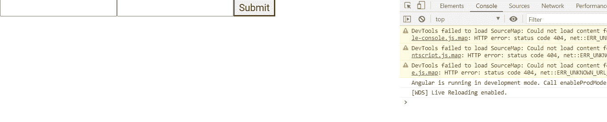

# AngularJS 表单 Submit()方法

> 原文:[https://www . geeksforgeeks . org/angular js-forms-ngsubmit-method/](https://www.geeksforgeeks.org/angularjs-forms-ngsubmit-method/)

在本文中，我们将了解 Angular 10 中的 ngSubmit 方法是什么，以及如何使用它。

当在表单上触发“提交”事件时，会调用 **ngSubmit()** 方法。

**语法:**

```ts
<form (ngSubmit)='method($event)'></form>
```

**参数:**

*   **$事件:**提交事件对象

**进场:**

*   创建要使用的 Angular 应用程序。
*   在 app.component.ts 中，创建一个从表单中获取值的数组。
*   在 app.component.html，制作一个表单并使用(ngSubmit)方法发送值。
*   使用 ng serve 为 angular app 服务，以查看输出。

**示例:**

## app.component.ts

```ts
import { Component, Inject } from '@angular/core';
import { FormGroup, FormControl, FormArray, NgForm } from '@angular/forms'
@Component({
    selector: 'app-root',
    templateUrl: './app.component.html',
    styleUrls: [ './app.component.css' ]
})
export class AppComponent  {
    submit(form: NgForm) {
        console.log(form.value);   
    }
}
```

## app.component.html

```ts
<form #form="ngForm" (ngSubmit)="submit(form)" novalidate>
    <input name="first" ngModel required #first="ngModel">
    <input name="last" ngModel>
    <button>Submit</button>
</form>
```

**输出:**



**参考:**T2】https://angular.io/api/forms/NgForm#onsubmit