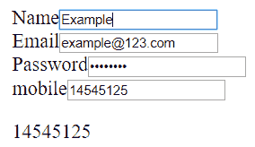
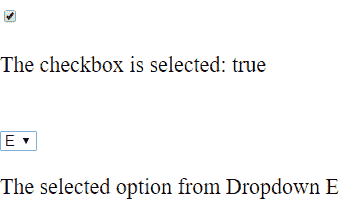
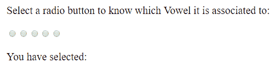
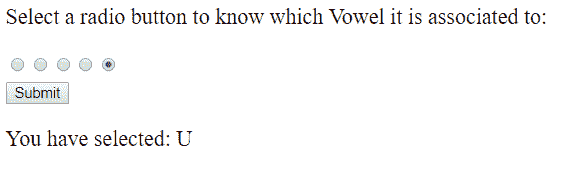

# 角度|形式

> 原文:[https://www.geeksforgeeks.org/angularjs-forms/](https://www.geeksforgeeks.org/angularjs-forms/)

表单是输入字段、按钮、复选框等控件的集合，这些控件可以通过
实时验证。一旦表单的用户完成了一个字段的编写并移动到下一个字段，它
就会被验证并向用户建议他可能出错的地方。

因此一个表单可以由许多控件组成
但是我们将关注

1.  输入栏
2.  检验盒
3.  收音机盒
4.  纽扣
5.  选择框(下拉菜单)

1) **输入字段:**
语法:

```

<input type="text" value="name" ng-model="name" placeholder="name">
```

可以添加各种约束来进行必要的验证，也可以使用 place-
holders 来预定义输入框，以方便用户，这样如果表单出现
错误，用户就不必重新输入正确的细节。

在**应用模块**中

```
import { FormsModule } from '@angular/forms'; 
```

并在下面添加 Formsmodule:

```
  imports: [
    BrowserModule,
    FormsModule,
  ],

```

创建表单时始终包含上述代码。
**例 1:**
在**app.component.html**

```
<form>
        <div class="form-group">
            <label for="firstName">Name</label>
            <input type="text" 
            id="firstName"
            placeholder="Name">
       </div>
        <div class="form-group">
            <label for="email">Email</label>
            <input 
            type="text" 
            id="email" 
            placeholder="Email">
         </div>    
        <div class="form-group">
            <label for="password">Password</label>
            <input 
                type="password"
                id="password" 
                placeholder="Password">
        </div>
        <div class="form-group">
            <label for="phone">mobile</label>
            <input 
            type="text"  
            id="phone" 
            ngModel name="phone"
            #phone="ngModel"
            placeholder="Mobile">
        </div>
    </form>
    <p>{{ phone.value }}</p>
```

为了使用输入框中写入的值，我们通过双向绑定将其存储在变量中。

**输出:**


**复选框和选择(下拉菜单):**
在表单中，当选择时，在 ngModel 中定义的变量存储为真，否则为假。
在选择中，所选值存储在 ngModel 中定义的变量中。

**例 2:**app.component.html**T2**

```
  <form>
    <input id="myVar" type="checkbox" ngModel name="myVar" #myVar="ngModel">
    <p>The checkbox is selected: {{myVar.value}}</p>
<br />
    <select ngModel name="mychoice" #myChoice="ngModel">
        <option>A</option>
        <option>E</option>
        <option>I</option>
        <option>O</option>
        <option>U</option>
    </select>
    <p>The selected option from Dropdown {{ myChoice.value }}</p>
</form>
```

**输出**


**单选按钮和按钮**
表单中使用的单选按钮应该一次只允许选择一个字段，以确保这是
的情况，我们应该只将其与 ngModel 相关联。

**例 3(单选按钮):**app.component.html**T2**

```
<form>
      <p>Select a radio button to know which Vowel it is associated to:</p>
    <input value="A" type="radio" ngModel name="myVar" #myVar="ngModel">
    <input value="E" type="radio" ngModel name="myVar" #myVar="ngModel">
    <input value="I" type="radio" ngModel name="myVar" #myVar="ngModel">
    <input value="O" type="radio" ngModel name="myVar" #myVar="ngModel">
    <input value="U" type="radio" ngModel name="myVar" #myVar="ngModel">
<br/><button *ngIf='myVar.touched'>Submit</button>
</form>
<p>You have selected: {{myVar.value}}</p>
```

在此代码中，该按钮只有在选择其中一个单选按钮后才可见。然而，当您选择它时，它不会立即可见，因为当您选择它时，被触摸的字段(至少被选择一次)变为
真，但是如果它是预加载的，它不会反映在按钮中。
所以这个按钮只有在我们点击屏幕上的任何地方或者我们改变选择时才可见。

选择前:


选择后:


我们可以将[验证](https://www.geeksforgeeks.org/angularjs-form-validation/)添加到所有这些输入类型中，并使我们的表单具有响应性。