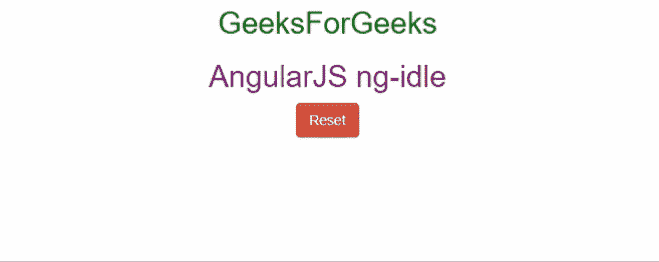

# AngularJS |如何使用 ng-idle？

> 原文:[https://www.geeksforgeeks.org/angularjs-how-to-use-ng-idle/](https://www.geeksforgeeks.org/angularjs-how-to-use-ng-idle/)

**ng-idle** 用于减少应用、网站、程序或软件的负担、带宽和工作量。借助 ng-idle 注销非活跃用户的会话，这样我们的宝贵数据&的工作量得到保留，甚至可以嘲讽他们更积极地参与。

**ng-idle** 是模块，需要响应和处理模块中的空闲用户。 **ng-idle** 指令通过使用用户界面引导中的 **$uibModal** 显示警告对话框。它将倒计时剩余时间，直到会话超时。应用程序将向 HTTP 发送一个请求，该请求将结束我们或任何用户的当前会话，发送错误消息，最后将他们重定向到初始登录页面/面板。因此，我们了解到 ng-idle 指令模块的主要目标是检测那些不活跃、行动迟缓或只是空闲的用户。但它还有另一项工作要做。它也可以被实现来通知、警告和警告用户即将超时。

这个模块的核心是 Idle 的服务，它擅长做，也是最擅长的。这完全基于用户的配置，并意识到用户的活跃性，然后检测用户是活跃的还是不活跃的，最后将信息传递给主应用程序，以便它可以做出适当的响应。

**注意:**需要 AngularJS 1.2 或更高版本。这是唯一需要的依赖项。

**语法:**该语法将作为依赖项包含在模块中，以完成角度配置。

```ts
var myApp = angular.module("myApp", ['ngIdle']);
```

让我们通过一个例子来看看 ng-idle 的用法。
**例:**

```ts
<!DOCTYPE html>
<html>

<head>
    <title>
        AngularJS ng-Idle
    </title>

    <script type="text/javascript" 
            src=
"https://cdnjs.cloudflare.com/ajax/libs/angular.js/1.4.8/angular.js">
  </script>
    <script type="text/javascript" 
            src=
"https://rawgithub.com/hackedbychinese/ng-idle/master/angular-idle.js">
  </script>

    <link rel="stylesheet"
          type="text/css" 
          href=
"https://netdna.bootstrapcdn.com/bootstrap/3.0.3/css/bootstrap.min.css">

    <link rel="stylesheet" 
          type="text/css" 
          href=
"https://netdna.bootstrapcdn.com/bootstrap/3.0.3/css/bootstrap-theme.min.css">

    <script type="text/javascript"
            src=
"https://cdnjs.cloudflare.com/ajax/libs/angular-ui-bootstrap/0.12.1/ui-bootstrap-tpls.js">
  </script>

    <script type="text/javascript">
        var app = angular.module('myApp', ['ngIdle', 'ui.bootstrap']);
        app.controller(
          'DemoCtrl', function($scope, Idle, Keepalive, $modal) {
            $scope.started = false;

            function closeModals() {
                if ($scope.warning) {
                    $scope.warning.close();
                    $scope.warning = null;
                }

                if ($scope.timedout) {
                    $scope.timedout.close();
                    $scope.timedout = null;
                }
            }

            $scope.$on('IdleStart', function() {
                closeModals();

                $scope.warning = $modal.open({
                    templateUrl: 'warning-dialog.html',
                    windowClass: 'modal-warning'
                });
            });

            $scope.$on('IdleEnd', function() {
                closeModals();
            });

            $scope.$on('IdleTimeout', function() {
                closeModals();
                $scope.timedout = $modal.open({
                    templateUrl: 'timedout-dialog.html',
                    windowClass: 'modal-danger'
                });
            });

            $scope.start = function() {
                console.log('start');
                closeModals();
                Idle.watch();
                $scope.started = true;
            };

            $scope.stop = function() {
                console.log('stop');
                closeModals();
                Idle.unwatch();
                $scope.started = false;

            };
        });

        app.config(function(IdleProvider, KeepaliveProvider) {
            IdleProvider.idle(5);
            IdleProvider.timeout(5);
            KeepaliveProvider.interval(10);
        });
    </script>
</head>

<body>

    <body style="text-align:center">
        <h2 style="color:green">GeeksForGeeks</h2>
        <h2 style="color:purple">AngularJS ng-idle</h2>
        <div ng-app="myApp" class="ng-scope">
            <div ng-controller="DemoCtrl"
                 class="ng-scope">

                <p>
                    <button type="button" 
                            class="btn btn-success" 
                            ng-hide="started"
                            ng-click="start()">
                      Login
                  </button>
                    <button type="button" 
                            class="btn btn-danger ng-hide" 
                            data-ng-show="started"
                            data-ng-click="stop()">
                      Reset
                  </button>
                </p>

            </div>

            <script type="text/ng-template" id="warning-dialog.html">
                <div class="modal-header">
                    <h3>
                        The Idle mode is activated, 
                        because you are idle for far too long.
                        As a result, you are going to be
                        logout after in a few moments.
                </h3>
                </div>
                <div idle-countdown="countdown" 
                     ng-init="countdown=5" class="modal-body">

                    <progressbar max="5" 
                                 value="5"
                                 animate="false" 
                                 class="progress-striped active">
                                     DO SOMETHING FAST! You are
                                     getting logged out in {{countdown}} second(s).
                   </progressbar>
                </div>
            </script>

            <script type="text/ng-template" id="timedout-dialog.html">
                <div class="modal-header">
                    <h3>Sorry, you have been Logged Out</h3>
                </div>
                <div class="modal-body">
                    <p>
                        This program was idle for far too long.
                        So we apologize for logging you out, 
                        but we had no option.
                    </p>
                </div>

            </script>

        </div>

    </body>

</html>
```

**输出:**
