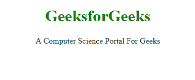
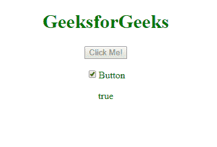

# 安圭拉\ html 之家

> 哎哎哎:# t0]https://www . geeksforgeeks . org/angolajs-html-DOM/

**ng-show 和 ng-hide 指令:**
这两个指令都用于**显示**或**隐藏**HTML 的元素。这取决于指令的价值。数值为**“真”**或**“假”**。

**示例-1:**

```ts
<!DOCTYPE html>
<html>
<script src=
"https://ajax.googleapis.com/ajax/libs/angularjs/1.6.9/angular.min.js">
  </script>

<body>
    <center>
        <div ng-app="">
            <!-- ng-show =true -->
            <h1 style="color:green" ng-show="true">
              GeeksforGeeks</h1>

            <!-- ng-show =false -->
            <p ng-show="false">GeeksforGeeks</p>

            <!-- ng-hide =true -->
            <p ng-hide="true">ng-hide is true</p>

            <!-- ng-hide =false -->
            <p ng-hide="false">
              A Computer Science Portal For Geeks</p>
        </div>
    </center>
</body>

</html>
```

**输出:**

**ng-disabled 指令:**
禁用 HTML 元素的属性。它将数据绑定到禁用的 HTML 元素的属性。
**示例-2:**

```ts
<!DOCTYPE html>
<html>
<script src=
"https://ajax.googleapis.com/ajax/libs/angularjs/1.6.9/angular.min.js">
  </script>

<body>
    <center>
        <h1 style="color:green">GeeksforGeeks</h1>
        <div ng-app="" ng-init="mySwitch=true">
            <p>
                <button ng-disabled="mySwitch" 
                        onclick="alert('Not Disabled')">
                  Click Me!
              </button>
            </p>
            <p>
                <input type="checkbox" 
                       ng-model="mySwitch"/>
              Button
            </p>
            <p>
                {{ mySwitch }}
            </p>
        </div>
    </center>
</body>

</html>
```

**输出:**
