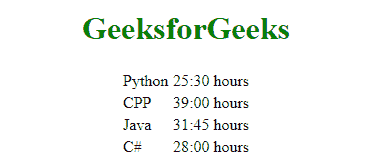

# AngularJS |包括

> 原文:[https://www.geeksforgeeks.org/angularjs-includes/](https://www.geeksforgeeks.org/angularjs-includes/)

html 不支持在 html 中嵌入 HTML 页面，这就是我们使用 AngularJS Include 指令的原因。通过使用 ng-controller 指令，我们可以轻松完成任务。

**语法:**

```
<element ng-include=" ">content...<element>

```

**示例:**

```
<!DOCTYPE html>
<html>
<head>
    <script src=
"https://ajax.googleapis.com/ajax/libs/angularjs/1.6.9/angular.min.js">
    </script>
    <title>ng-include directives</title>
</head>

<body ng-app="">
    <center>
        <h1 style="color:green;">GeeksforGeeks</h1>
        <div ng-include="'geeks.html'"></div>
    </center>
</body>
</html>
```

**输出:**

**包含 AngularJS 代码:**类似于前面的情况，您可以使用 ng-include 包含 html 文件，类似地，它也可以包含 AngularJS 代码。

**示例:**

**GeeksforGeeks.html table:**

```
<table>
  <tr ng-repeat="x in courses">
    <td>{{ x.Course }}</td>
    <td>{{ x.Duration }}</td>
  </tr>
</table>
```

**代码:**

```
<!DOCTYPE html>
<html>
<head>
  <script src=
"https://ajax.googleapis.com/ajax/libs/angularjs/1.6.9/angular.min.js">
  </script>
</head>
<body>
  <div ng-app="geeks" ng-controller="customersCtrl"> 
    <div ng-include="'Geekstable.html'"></div>
  </div>
  <script>
    var app = angular.module('geeks', []);
    app.controller('customersCtrl', function($scope, $http) {
         $http.get("customers.php").then(function (response) {
             $scope.courses = response.data.records;
             });
         });
  </script>
</body>
</html>
```

**输出:**


**包含跨域:**如果您想要包含来自另一个域的文件，那么您可以在应用程序的配置功能中添加合法文件或域的白名单。
T3】样本代码:

```
<!DOCTYPE html>
<html>
  <script src=
"https://ajax.googleapis.com/ajax/libs/angularjs/1.6.9/angular.min.js">
  </script>
<body ng-app="myApp">
  <div ng-include="'filel_path_from_anotherDomain'"></div>
  <script>
    var app = angular.module('myApp', [])
    app.config(function($sceDelegateProvider) {
        $sceDelegateProvider.resourceUrlWhitelist(['filel_path_from_anotherDomain']);
    });
  </script>
</body>
</html>
```