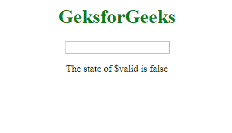
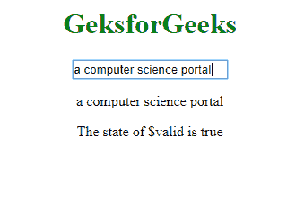
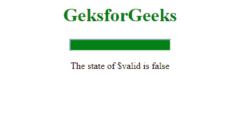
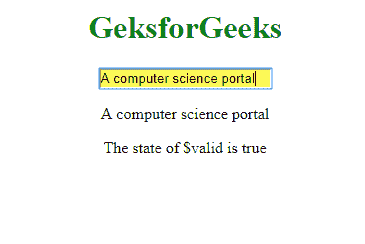

# AngularJS |输入指令

> 原文:[https://www.geeksforgeeks.org/angularjs-input-directive/](https://www.geeksforgeeks.org/angularjs-input-directive/)

Input 是一个 HTML 标签，用于获取用户**输入，ng-model** 是一个角度指令，用于数据绑定(即输入元素的引用由 **ng-model** 提供)。这两者结合起来修改输入字段。

**语法:**

```
<input ng-model="name">
```

**以下状态被建立到输入字段，其值对于以下情况为真。**

*   **$未触及:**未触及字段时
*   **$触摸:**场被触摸时
*   **$原始:**当字段未被修改时
*   **$dirty:** 字段被修改时
*   **$无效:**当字段内容无效时
*   **$有效:**当字段内容有效时

**示例:****$表单中所需输入字段的有效**状态解释如下

```
<!DOCTYPE html>

<html>

<script src=
"https://ajax.googleapis.com/ajax/libs/angularjs/1.6.9/angular.min.js">
</script>

<body ng-app="">
    <center>
        <h1 style="color:green">
        GeksforGeeks
    </h1>

        <form name="form1">

            <input name="var1"
                ng-model="var1"
                required>
        </form>

        <p>{{var1}}</p>

        <p>The state of $valid is {{form1.var1.$valid}}</p>
    </center>
</body>

</html>                    
```

**输出:**
**前:**


**之后:**


**对于上述输入指令，增加的 CSS 类很少。它们是:**

*   **ng-未触及:**该字段尚未触及
*   **ng-已触摸:**该字段已被触摸
*   **ng-原始:**该字段尚未修改
*   **ng-dirty:** 字段已被修改
*   **ng-valid:** 字段内容有效
*   **ng-无效:**字段内容无效
*   **ng-valid-key:** 每次验证一个键。
    示例:**ng-valid-必填**
*   无效键:每次验证一个键。
    示例:**ng-无效-必填**

如果值为*假*，则删除类别。

**示例:**
如果输入字段与所需属性一起使用，将建立有效(有输入时设置为真)和无效(无输入时设置为真)状态。如果该值为 false，则移除这些类。

```
<!DOCTYPE html>

<html>

<head>
    <title>
        input Directive
    </title>
    <style>
        input.ng-invalid {
            background-color: green;
        }

        input.ng-valid {
            background-color: yellow;
        }
    </style>
</head>
<script src=
"https://ajax.googleapis.com/ajax/libs/angularjs/1.6.9/angular.min.js">
</script>

<body ng-app="">
    <center>
        <h1 style="color:green">
        GeksforGeeks
    </h1>

        <form name="form1">

            <input name="var1"
                   ng-model="var1"
                   required>
        </form>

        <p>{{var1}}</p>

        <p>
          The state of $valid is
          {{form1.var1.$valid}}
      </p>
    </center>
</body>

</html>
```

**输出:**
**前:**

**后:**
