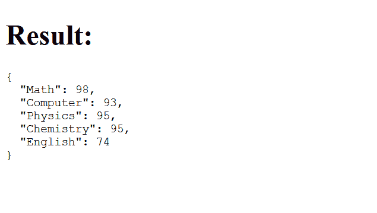
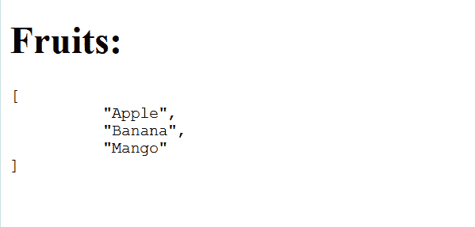

# 角型\ json 滤波器

> 原文:[https://www.geeksforgeeks.org/angularjs-json-filter/](https://www.geeksforgeeks.org/angularjs-json-filter/)

AngularJs 中的 **json** 过滤器用于将 JavaScript 对象转换为 json。字符串。我们正在使用的 JavaScript 对象可以是任何类型的 JavaScript 对象。

**语法:**

```
    {{ object | json : spacing }}

```

其中 **json** 用于指定对象应以 json 格式显示，**间距**是可选参数，默认值为 2，指定每个缩进的空格数。

**示例 1:**
本示例将显示 JSON 中学生的分数

```
<!DOCTYPE html>
<html>
    <head>
<script src=
"https://ajax.googleapis.com/ajax/libs/angularjs/1.6.9/angular.min.js">
</script>
    </head>
<body>

<div ng-app="result" ng-controller="resultCtrl">

<h1>Result:</h1>

<pre>{{marks | json}}</pre>

</div>

<script>
var app = angular.module('result', []);
app.controller('resultCtrl', function($scope) {
$scope.marks = { 
        "Math" : 98,
        "Computer" : 93,
        "Physics" : 95,
        "Chemistry" : 95,
        "English" : 74
    };
});
</script>

</body>
</html>
```

**输出:**



**示例 2:**
该示例将在 JSON 中显示水果名称，每个缩进 10 个空格

```
<!DOCTYPE html>
<html>
<head>
<script src=
"https://ajax.googleapis.com/ajax/libs/angularjs/1.6.9/angular.min.js">
</script>
</head>
<body>

<div ng-app="fruit" ng-controller="fruitCtrl">

<h1>Fruits:</h1>

<pre>{{fruit | json : 10}}</pre>

</div>

<script>
var app = angular.module('fruit', []);
app.controller('fruitCtrl', function($scope) {
    $scope.fruit = ["Apple", "Banana", "Mango"];
});
</script>

</body>
</html>
```

**输出:**

