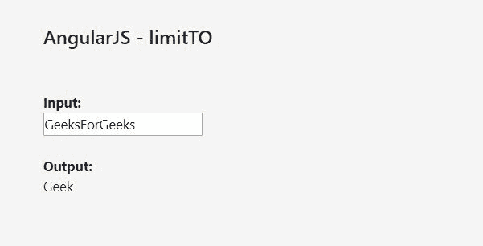
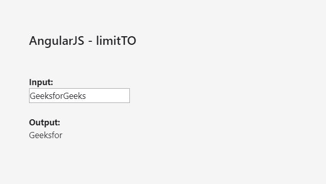

# 角型\极限过滤器

> 原文:[https://www.geeksforgeeks.org/angularjs-limitto-filter/](https://www.geeksforgeeks.org/angularjs-limitto-filter/)

AngularJS 中的 **limitTo** 过滤器用于**返回** *一个包含指定数量元素的数组或字符串*。该过滤器可用于数组、字符串和数字。然而，基本原则在所有三种情况下都是一样的。

*   对于数组，它返回一个只包含指定数量项的数组。
*   当用于字符串时，它返回另一个包含指定字符数的字符串。
*   对于数字，它返回一个只包含指定位数的字符串。
*   负数用于从元素的末尾而不是开始返回元素。

**语法:**

```ts
{{ object | limitTo : limit : begin }}
```

**参数:**

*   **限制:**返回元素的数量。
*   **开始:**开始限制点。默认值为 0。

**示例-1:**

```ts
<!DOCTYPE html>
<html>
<script src=
"https://ajax.googleapis.com/ajax/libs/angularjs/1.6.9/angular.min.js">
  </script>

<body>

    <h2>AngularJS - limitTO</h2>
    <br>
    <br>

    <div ng-app="myApp" ng-controller="myCtrl">

        <strong>Input:</strong>
        <br>
        <input type="text" ng-model="string">
        <br>
        <br>
        <strong>Output:</strong>
        <br>
        {{string|limitTo:4}}

    </div>

    <script>
        var app = angular.module('myApp', []);
        app.controller('myCtrl', function($scope) {
            $scope.string = "";
        });
    </script>

</body>

</html>
```

**输出:**


让我们看另一个例子，让事情变得更清楚。
**例-2:**

```ts
<!DOCTYPE html>
<html>
<script src=
"https://ajax.googleapis.com/ajax/libs/angularjs/1.6.9/angular.min.js">
  </script>

<body>

    <h2>AngularJS - limitTO</h2>
    <br>
    <br>

    <div ng-app="myApp"
         ng-controller="myCtrl">

        <strong>Input:</strong>
        <br>
        <input type="text"
               ng-model="firstName">
        <br>
        <br>
        <strong>Output:</strong>
        <br> {{firstName|limitTo:8}}

    </div>

    <script>
        var app = angular.module('myApp', []);
        app.controller('myCtrl', function($scope) {
            $scope.firstName = "";
        });
    </script>

</body>

</html>
```

**输出:**


在这个例子中，我们可以看到“名字”表达式中的限制被指定为 8。因此，用户的名字有多长并不重要，只会显示名字的前 8 个字符。