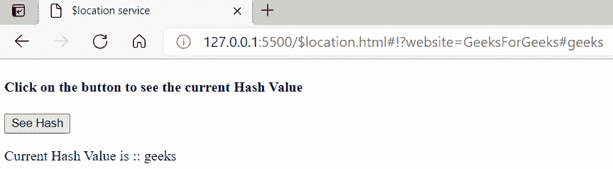

# AngularJS $定位服务

> 原文:[https://www.geeksforgeeks.org/angularjs-location-service/](https://www.geeksforgeeks.org/angularjs-location-service/)

AngularJS 中的$location 基本上使用 window.location 服务。$location 用于读取或更改浏览器中的网址，并用于在我们的页面上反映该网址。URL 中的任何更改都存储在 AngularJS 中的$location 服务中。$location 服务中有各种方法，如 absUrl()、url([URL])、协议()、主机()、端口()、路径([path])、搜索(search、[paramValue])、哈希([hash])、替换()和状态([state])。此外，还有两个可用事件，即$locationChangeStart 和$ locationChangeSuccess。

现在让我们一个一个地看看$location service 的一些方法。

**1。方法:**它返回页面的完整路径，是一个只读方法。

## 超文本标记语言

```ts
<!DOCTYPE html>
<html>

<head>
    <title>$location service</title>
    <script src=
"https://ajax.googleapis.com/ajax/libs/angularjs/1.6.9/angular.min.js">
    </script>
</head>

<body ng-app="locationService">
    <h4>Click on the button to see the current URL</h4>
    <div ng-controller="locationServiceController">
        <button ng-click="seeURL()">See URL</button>

        <p>Current URL is :: {{currentURL}}</p>
    </div>

    <script>
        var app = angular.module('locationService', []);
        app.controller('locationServiceController',
            ['$scope', '$location', function ($scope, $location) {
                $scope.seeURL = function () {
                    $scope.currentURL = $location.absUrl();
                }
            }]);
    </script>
</body>

</html>
```

**输出:**


**2。port()方法:**它也是一个只读方法，返回您当前工作的端口号。

## 超文本标记语言

```ts
<!DOCTYPE html>
<html>

<head>
    <title>$location service</title>
    <script src=
"https://ajax.googleapis.com/ajax/libs/angularjs/1.6.9/angular.min.js">
    </script>
</head>

<body ng-app="locationService">
    <h4>
        Click on the button to see 
        the current PORT number
    </h4>
    <div ng-controller="locationServiceController">
        <button ng-click="seePort()">See Port Number</button>

        <p>Current Port number is :: {{currentPort}}</p>
    </div>

    <script>
        var app = angular.module('locationService', []);
        app.controller('locationServiceController',
            ['$scope', '$location',
                function ($scope, $location) {
                    $scope.seePort = function () {
                        $scope.currentPort = $location.port();
                    }
                }]);
    </script>
</body>

</html>
```

**输出:**


**3。protocol()方法:**返回当前 URL 的当前协议，也是只读方法。

## 超文本标记语言

```ts
<!DOCTYPE html>
<html>

<head>
    <title>$location service</title>
    <script src=
"https://ajax.googleapis.com/ajax/libs/angularjs/1.6.9/angular.min.js">
    </script>
</head>

<body ng-app="locationService">
    <h4>Click on the button to see the current Protocol</h4>
    <div ng-controller="locationServiceController">
        <button ng-click="seeProtocol()">See Protocol</button>

        <p>Current Protocol is :: {{currentProtocol}}</p>

    </div>

    <script>
        var app = angular.module('locationService', []);
        app.controller('locationServiceController',
            ['$scope', '$location',
                function ($scope, $location) {
                    $scope.seeProtocol = function () {
                        $scope.currentProtocol 
                            = $location.protocol();
                    }
                }]);
    </script>

</body>

</html>
```

**输出:**


**4。host()方法:**返回当前 URL 的当前主机，也是只读方法。

## 超文本标记语言

```ts
<!DOCTYPE html>
<html>

<head>
    <title>$location service</title>
    <script src=
"https://ajax.googleapis.com/ajax/libs/angularjs/1.6.9/angular.min.js">
    </script>
</head>

<body ng-app="locationService">
    <h4>Click on the button to see the current Host</h4>
    <div ng-controller="locationServiceController">
        <button ng-click="seeHost()">See Host</button>

        <p>Current Host is :: {{currentHost}}</p>
    </div>

    <script>
        var app = angular.module('locationService', []);
        app.controller('locationServiceController',
            ['$scope', '$location', function ($scope, $location) {
                $scope.seeHost = function () {
                    $scope.currentHost = $location.host();
                }
            }]);
    </script>
</body>

</html>
```

**输出:**


**5。search()方法:**是一个$location 的读写方法。当不带参数传递时，它返回 URL 的当前搜索参数；当带参数传递时，它返回$location 对象。

## 超文本标记语言

```ts
<!DOCTYPE html>
<html>

<head>
    <title>$location service</title>
    <script src=
"https://ajax.googleapis.com/ajax/libs/angularjs/1.6.9/angular.min.js">
    </script>
</head>

<body ng-app="locationService">
    <h4>Click on the button to see the current Search</h4>
    <div ng-controller="locationServiceController">
        <button ng-click="seeSearch()">See Search</button>

        <p>Current Search is :: {{currentSearch}}</p>
    </div>

    <script>
        var app = angular.module('locationService', []);
        app.controller('locationServiceController',
            ['$scope', '$location', function ($scope, $location) {
                $scope.seeSearch = function () {
                    $location.search("website", "GeeksForGeeks");
                    $scope.currentSearch = $location.search();
                }
            }]);
    </script>
</body>

</html>
```

**输出:**


**6。hash()方法:**是$location 服务的读写方法。当不带参数调用时，它返回当前 URL 的当前哈希值；当带参数调用时，它返回$location 对象。

## 超文本标记语言

```ts
<!DOCTYPE html>
<html>

<head>
    <title>$location service</title>
    <script src=
"https://ajax.googleapis.com/ajax/libs/angularjs/1.6.9/angular.min.js">
    </script>
</head>

<body ng-app="locationService">
    <h4>Click on the button to see the current Hash Value</h4>
    <div ng-controller="locationServiceController">
        <button ng-click="seeHash()">See Hash</button>

        <p>Current Hash Value is :: {{currentHash}}</p>
    </div>

    <script>
        var app = angular.module('locationService', []);
        app.controller('locationServiceController',
            ['$scope', '$location', function ($scope, $location) {
                $scope.seeHash = function () {
                    $location.hash("geeks");
                    $scope.currentHash = $location.hash();
                }
            }]);
    </script>
</body>

</html>
```

**输出:**

