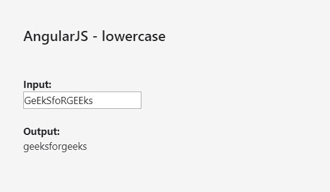
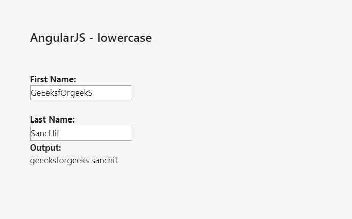

# AngularJS |小写过滤器

> 原文:[https://www.geeksforgeeks.org/angularjs-lowercase-filter/](https://www.geeksforgeeks.org/angularjs-lowercase-filter/)

**小写过滤器**用于*将字符串转换为小写字母*。

**语法:**

```
{{expression|lowercase}}
```

**示例-1:**

```
<!DOCTYPE html>
<html>
<script src=
"https://ajax.googleapis.com/ajax/libs/angularjs/1.6.9/angular.min.js">
  </script>

<body>

    <h2>AngularJS - lowercase</h2>
    <br>
    <br>

    <div ng-app="myApp" 
         ng-controller="myCtrl">

        <strong>Input:</strong>
        <br>
        <input type="text" 
               ng-model="string">
        <br>
        <br>
        <strong>Output:</strong>
        <br> {{string|lowercase}}

    </div>

    <script>
        var app = angular.module('myApp', []);
        app.controller('myCtrl', function($scope) {
            $scope.string = "";
        });
    </script>

</body>

</html>
```



**示例-2:**

```
<!DOCTYPE html>
<html>
<script src=
"https://ajax.googleapis.com/ajax/libs/angularjs/1.6.9/angular.min.js">
  </script>

<body>

    <h2>AngularJS - lowercase</h2>
    <br>
    <br>

    <div ng-app="myApp"
         ng-controller="myCtrl">

        <strong>First Name:</strong>
        <br>
        <input type="text"
               ng-model="firstName">
        <br>
        <br>
        <strong>Last Name:</strong>
        <br>
        <input type="text" 
               ng-model="lastName">
        <br>

        <strong>Output:</strong>
        <br> {{firstName|lowercase}}
             {{lastName|lowercase}}

    </div>

    <script>
        var app = angular.module('myApp', []);
        app.controller('myCtrl', function($scope) {
            $scope.firstName = "";
            $scope.lastName = "";
        });
    </script>

</body>

</html>
```

**输出:**
