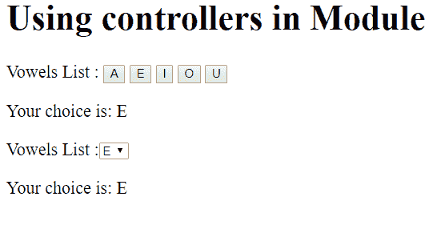

# AngularJS |模块

> 原文:[https://www.geeksforgeeks.org/angularjs-modules/](https://www.geeksforgeeks.org/angularjs-modules/)

AngularJS 模块定义了应用于整个网页的应用程序的功能。它有助于链接许多组件。所以它只是一组相关的组件。它是一个容器，由控制器、服务、指令等不同部分组成。

**注意:**这个模块应该在一个普通的 HTML 文件中制作，比如 index.html，不需要在 VisualStudio 中为这个部分创建一个新项目。

**如何创建模块:**

```
var app = angular.module("Module-name", []);
```

在这个[]中，我们可以添加所需组件的列表，但是在这个例子中，我们不包括任何组件。通过将这个创建的模块添加到模块列表中，它与 div、body 等任何标签绑定在一起。

```
<div ng-app = "module-name">
    The code in which the module is required.
</div>
```

**添加控制器:**

```
app.controller("Controller-name", function($scope) {
    $scope.variable-name= "";
});
```

在这里，我们可以在 controller 中添加任意数量的变量，并在 html 文件中使用它们，html 文件是标签的主体，在标签中，controller 通过编写:

```
<body>
<div ng-app="Module-name">
    <div ng-controller="Controller-name">
        {{variable-name}}
    </div>

<!-- This wont get printed since its
not part of the div in which 
controller is included -->
{{variable-name}}  
</div>
</body>
```

**文件中的模块和控制器:**虽然我们可以将模块和控制器与需要它的 HTML 文件放在同一个文件中，但是我们可能希望在其他文件中使用这个模块。因此，这将导致冗余，所以我们更愿意单独创建模块，控制器和 HTML 文件。模块和控制器将通过使用来存储。js 文件，为了在 HHTML 文件中使用它们，我们必须以这种方式包含它们:

**示例:**

*   **```
    // Here the Component name is DemoComponent
    // so saving the file as DemoComponent.js 
    app.controller('DemoController', function($scope) {

        $scope.list = ['A', 'E', 'I', 'O', 'U'];
        $scope.choice = 'Your choice is: GeeksforGeeks';

        $scope.ch = function(choice) {
            $scope.choice = "Your choice is: " + choice;
        };

        $scope.c = function() {
            $scope.choice = "Your choice is: " + $scope.mychoice;
        };
    });
    ```** 
*   **模块-名称:**demopapp . js**T0**
*   **T6】index.html 文件T1T10**

****输出:**
**

****注意:**它确保模块和组件文件在同一个文件夹中，否则提供保存和运行它们的路径。**

****模块中的指令:**要在模块中添加指令，请执行以下步骤:**

*   **像我们之前做的那样创建一个模块:

    ```
    var app = angular.module("DemoApp", []);
    ```** 
*   **创建指令:

    ```
    app.directive("Directive-name", function() {
        return {
            template : "string or some code which is to be executed"
        };
    });

    ```** 

****示例:****

```
<!DOCTYPE html>
<html>

<head>
    <title>
        Modules and Controllers in Files
    </title>    

    <script src=
"https://ajax.googleapis.com/ajax/libs/angularjs/1.6.9/angular.min.js">
    </script>
</head> 

<body>

  <div ng-app="GFG" w3-test-directive></div>

  <script>
  var gfg_app = angular.module("GFG", []);
  gfg_app.directive("w3TestDirective", function() {
      return {
          template : "Welcome to GeeksforGeeks!"
      };
  });
  </script>

</body>
</html>
```

****输出:****

```
Welcome to GeeksforGeeks!
```

****注意:**这里要打印的任何东西都不应该放在调用指令的 div 中，因为它会被模板中的代码覆盖。**