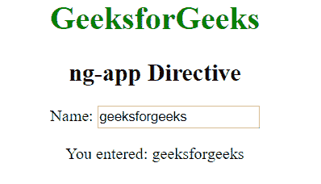

# angolajs | ng-app 指令

> 原文:[https://www.geeksforgeeks.org/angularjs-ng-app-directive/](https://www.geeksforgeeks.org/angularjs-ng-app-directive/)

AngularJS 中的 **ng-app 指令**用于定义 AngularJS 应用程序的根元素。该指令在页面加载时自动初始化 AngularJS 应用程序。它可以用来加载 AngularJS 应用程序中的各种模块。

**语法:**

```
<element ng-app=""> Contents... </element>
```

**示例 1:** 本示例使用 ng-app Directive 来定义默认的 AngularJS 应用程序。

```
<html>

<head>
    <title>AngularJS ng-app Directive</title>

    <script src=
"https://ajax.googleapis.com/ajax/libs/angularjs/1.6.9/angular.min.js">
    </script>
</head>

<body style="text-align:center">

    <h2 style = "color:green">ng-app directive</h2>

    <div ng-app="" ng-init="name='GeeksforGeeks'">
        <p>{{ name }} is the portal for geeks.</p>
    </div>
</body>

</html>
```

**输出:**


**示例 2:** 本示例使用 ng-app Directive 来定义默认的 AngularJS 应用程序。

```
<html>

<head>
    <title>AngularJS ng-app Directive</title>

    <script src=
"https://ajax.googleapis.com/ajax/libs/angularjs/1.6.9/angular.min.js">
    </script>
</head>

<body ng-app="" style="text-align: center">

    <h1 style="color:green">GeeksforGeeks</h1>
    <h2>ng-app Directive</h2>

    <div>
        <p>Name: <input type="text" ng-model="name"></p>
        <p>You entered: <span ng-bind="name"></span></p>
    </div>
</body>

</html>
```

**输出:**
