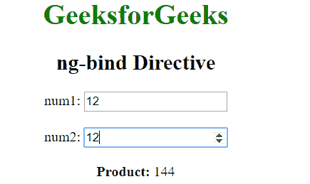
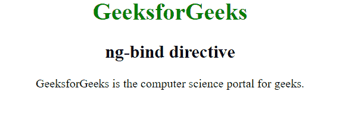

# 角度约束指令

> 原文:[https://www.geeksforgeeks.org/angularjs-ng-bind-directive/](https://www.geeksforgeeks.org/angularjs-ng-bind-directive/)

AngularJS 中的 **ng-bind 指令**用于用给定表达式中输入的值绑定/替换任何特定 HTML 元素的文本内容。每当 ng-bind 指令中表达式的值发生变化时，指定的 HTML 内容的值就会更新。
**语法:**

```ts
<element ng-bind="expression"> Contents... </element>
```

其中**表达式**用于指定要计算的表达式或变量。
**示例 1:** 本示例使用 ng-bind 指令将两个数字的乘积绑定到< span >元素。

## 超文本标记语言

```ts
<!DOCTYPE html>
<html>

<head>
    <title>ng-bind Directive</title>

    <script src=
"https://ajax.googleapis.com/ajax/libs/angularjs/1.6.9/angular.min.js">
    </script>
</head>

<body ng-app="gfg" style="text-align:center">

    <h1 style="color:green">GeeksforGeeks</h1>
    <h2>ng-bind Directive</h2>       

    <div ng-controller="app">
        num1: <input type="number" ng-model="num1"
                ng-change="product()" />
        <br><br>

        num2: <input type="number" ng-model="num2"
                ng-change="product()" />
        <br><br>

        <b>Product:</b> <span ng-bind="result"></span>
    </div>

    <script>
        var app = angular.module("gfg", []);
        app.controller('app', ['$scope', function ($app) {
            $app.num1 = 1;
            $app.num2 = 1;
            $app.product = function () {
                $app.result = ($app.num1 * $app.num2);
            }
        }]);
    </script>
</body>

</html>
```

**输出:**



**示例 2:** 本示例使用 ng-bind 指令将< span >元素的内部 HTML 绑定到变量文本。

## 超文本标记语言

```ts
<!DOCTYPE html>
<html>

<head>
    <title>ng-bind Directive</title>

    <script src=
"https://ajax.googleapis.com/ajax/libs/angularjs/1.6.9/angular.min.js">
    </script>
</head>

<body  style = "text-align:center">

    <h1 style = "color:green">GeeksforGeeks
    <h2 style = "">ng-bind directive</h2>

    <div ng-app="" ng-init="txt='GeeksforGeeks';col='green'">
        <div>
            <span ng-bind="txt"></span> is the
            computer science portal for geeks.
        </div>
    </div>
</body>

</html>
```

**输出:**

