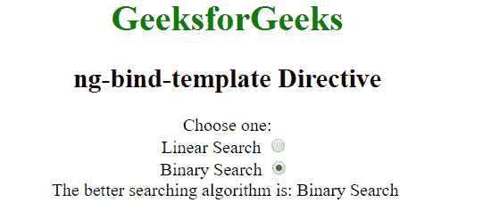

# AngularJS | ng-bind-模板指令

> 原文:[https://www . geeksforgeeks . org/angular js-ng-bind-template-direction/](https://www.geeksforgeeks.org/angularjs-ng-bind-template-directive/)

AngularJS 中的 **ng-bind-template 指令**用于用给定表达式的值替换 HTML 元素的内容。它用于绑定多个表达式。它可以有多个 **{{ }}** 表情。所有 HTML 元素都支持它。

**语法:**

```ts
<element ng-bind-template="expression"> Contents... &ltl;/element>
```

**示例 1:** 本示例使用 ng-bind-template Directive 显示绑定内容。

```ts
<!DOCTYPE html>
<html>

<head>
    <title>
        ng-bind-template Directive
    </title>

    <script src=
"https://ajax.googleapis.com/ajax/libs/angularjs/1.4.2/angular.min.js">
    </script>
</head>

<body ng-app="app" style="text-align:center">

    <h1 style="color:green">GeeksforGeeks</h1>
    <h2>ng-bind-template Directive</h2>

    <div ng-controller="geek">
        Choose one:<br>
        <label>Linear Search 
            <input type="radio" name="r1" ng-model="search"
                    value="Linear Search" /> 
        </label><br>

        <label>Binary Search 
            <input type="radio" name="r1" ng-model="search"
                    value="Binary Search" />
        </label><br>

        <span ng-bind-template="{{msg}} {{search}}"></span>
        <br>
    </div>

    <script>
        var app = angular.module("app", []);
        app.controller('geek', ['$scope', function ($scope) {
            $scope.msg="The better searching algorithm is: ";
            $scope.search = ""
        }]);
    </script>
</body>

</html>                    
```

**输出:**
**选择单选按钮前:**

**选择单选按钮后:**


**示例 2:** 本示例使用 ng-bind-template Directive 显示绑定内容。

```ts
<!DOCTYPE html>
<html>

<head>
    <title>ng-bind-template Directive</title>

    <script src=
"https://ajax.googleapis.com/ajax/libs/angularjs/1.4.2/angular.min.js">
    </script>
</head>

<body ng-app="app" style="text-align:center">

    <h1 style="color:green">GeeksforGeeks</h1>
    <div ng-controller="geek">
        <label>Football
            <input min="0" type="number" ng-model="Football" />
        </label>

        <br><br>

        Count of Footballs: 
        <span ng-bind-template="{{Football}}"></span><br>
    </div>

    <script>
        var app = angular.module("app", []);
        app.controller('geek', ['$scope', function ($scope) {
            $scope.Football = "";
        }]);
    </script>
</body>

</html>                            
```

**输出:**
**输入数字前:**

**输入数字后:**
