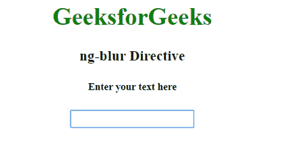
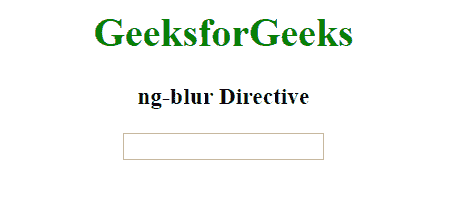
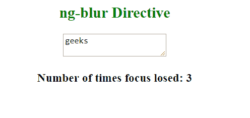

# 角度模糊指令

> 原文:[https://www.geeksforgeeks.org/angularjs-ng-blur-directive/](https://www.geeksforgeeks.org/angularjs-ng-blur-directive/)

当一个 HTML 元素失去焦点时，AngularJS 中的 **ng-blur 指令**被触发。它不会用元素 original on bulr 事件重写，即 ng-blur 表达式和 original on bulr 事件都将执行。

**语法:**

```ts
<element ng-blur="expression"> Contents... </element>

```

其中**表达式**是指待求值的变量或表达式。

**注意:**ng-blur 指令由<输入>、< a >、<选择>和<文本区>支持。

**示例 1:** 本示例在输入焦点集中时显示文本消息“在此输入您的文本”，在输入焦点丢失时隐藏。

```ts
<!DOCTYPE html>
<html>

<head>
    <title>ng-blur Directive</title>

    <script src=
"https://ajax.googleapis.com/ajax/libs/angularjs/1.6.9/angular.min.js">
    </script>
</head>

<body style="text-align:center">

    <h1 style="color:green">GeeksforGeeks</h1>
    <div ng-app="app">
        <div ng-controller="gfg">
            <h3>ng-blur Directive</h3>
            <h5 ng-show="msg">Enter your text here</h5>
            <input type="text" ng-focus="msg=true" ng-blur="msg=false" />
        </div>
    </div>
    <script>
        var app = angular.module("app", []);
        app.controller('gfg', ['$scope', function ($fun, $timeout) {
                $fun.msg = false;
        }]);
    </script>
</body>

</html>
```

**输出:**
**当输入集中时:**

**当输入不集中时:**


**示例 2:** 本示例统计焦点从文本区域移除的次数。

```ts
<!DOCTYPE html>
<html>

<head>
    <title>ng-blur Directive</title>

    <script src=
"https://ajax.googleapis.com/ajax/libs/angularjs/1.6.9/angular.min.js">
    </script>
</head>

<body ng-app="" style="text-align:center">

    <h2 style="color:green">ng-blur Directive</h2>
    <textarea ng-blur="count = count + 1" ng-init="count=0">
    </textarea>

    <h3>Number of times focus losed: {{count}}</h3>
</body>

</html>
```

**输出:**
