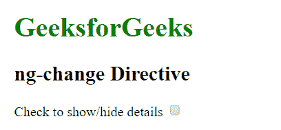
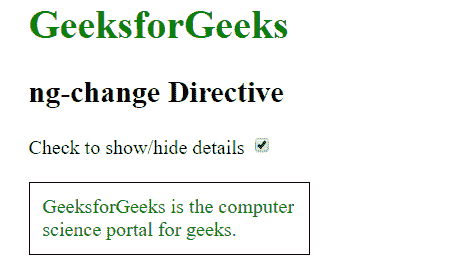
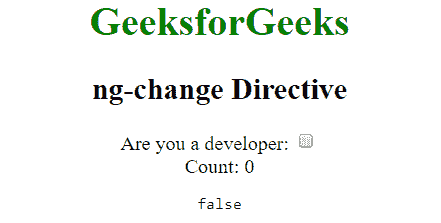
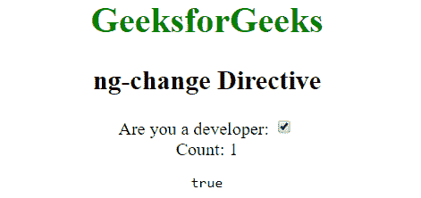

# AngularJS | ng-变更指令

> 原文:[https://www . geeksforgeeks . org/angular js-ng-change-direction/](https://www.geeksforgeeks.org/angularjs-ng-change-directive/)

每当输入元素的值发生变化时，都会使用 AngularJS 中的 **ng-change 指令**。只要输入值发生变化，就会立即计算表达式。它需要一个 ng-model 指令。只要输入有任何单一变化，就会触发。它可以与输入元素一起使用，如<输入>、<文本区>、<复选框>和<选择>

**语法:**

```
<element ng-change="expression"> Contents... </element>
```

其中**表达式**是指每当输入值发生变化时要执行的表达式。

**示例 1:** 本示例使用 ng-change 指令使用复选框显示/隐藏一些内容。

```
<!DOCTYPE html>
<html>

<head>
    <title>ng-change Directive</title>

    <script src=
"https://ajax.googleapis.com/ajax/libs/angularjs/1.6.9/angular.min.js">
    </script>

    <script type="text/javascript">
        var app = angular.module('geek', []);
        app.controller('app', function ($scope) {
            $scope.show = function () {
                if ($scope.check == true)
                    $scope.result = true;
                else
                    $scope.result = false;
            }
        });
    </script>
</head>

<body style="padding: 30px">
    <div ng-app="geek" ng-controller="app">
        <h1 style="color:green">GeeksforGeeks</h1>
        <h2>ng-change Directive</h2>

        Check to show/hide details <input type="checkbox"
                    ng-change="show()" ng-model="check">
        <br><br>

        <div style="padding:10px; border:1px solid black; 
                width:30%;color:green" ng-show='result'>
            GeeksforGeeks is the computer science
            portal for geeks.
        </div>
    </div>
</body>

</html>
```

**输出:**
**之前勾选了复选框:**

**之后勾选了复选框:**


**示例 2:** 本示例返回复选框状态更改的次数以及复选框的当前状态。

```
<!DOCTYPE html>
<html>

<head>
    <title>ng-change Directive</title>

    <script src=
"https://ajax.googleapis.com/ajax/libs/angularjs/1.6.9/angular.min.js">
    </script>
</head>

<body ng-app="geek" style="text-align:center">
    <h1 style="color:green">GeeksforGeeks</h1>
    <h2>ng-change Directive</h2>
    <div ng-controller="prop">
        <div>
            Are you a developer:  
            <input type="checkbox" ng-model="isTrue"
            ng-change="cnt=cnt+1" ng-init="cnt=0"/>
        </div>
        Count: {{cnt}}
        <pre>{{isTrue}}</pre>
    </div>

    <script>
        var app = angular.module("geek", []);
        app.controller('prop', ['$scope', function ($app) {
            $app.isTrue = false;
        }]);
    </script>
</body>

</html>
```

**输出:**
**之前勾选了复选框:**

**之后勾选了复选框:**
