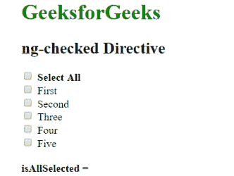
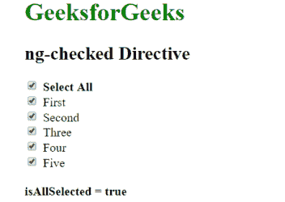

# 角度检查指令

> 原文:[https://www . geeksforgeeks . org/angularjs-ng-checked-direction/](https://www.geeksforgeeks.org/angularjs-ng-checked-directive/)

AngularJS 中的 **ng-checked 指令**用于将复选框或单选按钮的选中或未选中状态读取为真或假。如果 ng-checked 属性中的表达式返回 true，则复选框/单选按钮将被选中，否则将被取消选中。

**语法:**

```
<input type="checkbox|radio" ng-checked="expression"> Contents... </input>
```

如果表达式返回 true，则将检查元素的选中属性。

**示例:**本示例使用 ng-checked 指令选择复选框并返回所有选中的复选框值。

```
<!DOCTYPE html>
<html>

<head>
    <title>ng-checked Directive</title>

    <script src=
"https://ajax.googleapis.com/ajax/libs/angularjs/1.6.9/angular.min.js">
    </script>
</head>

<body ng-app="app">
    <div ng-controller="geek">
        <h1 style="color:green">GeeksforGeeks</h1>
        <h2>ng-checked Directive</h2>

        <input type="checkbox" ng-checked="check1 &&
                check2 && check3 && check4 && check5"
                ng-model="isChecked" /><b>Select All</b><br>

        <input type="checkbox" ng-model="check1" 
            ng-checked="isChecked" />First<br>

        <input type="checkbox" ng-model="check2" 
            ng-checked="isChecked" />Second<br>

        <input type="checkbox" ng-model="check3"
            ng-checked="isChecked" />Three<br>

        <input type="checkbox" ng-model="check4" 
            ng-checked="isChecked" /> Four<br>

        <input type="checkbox" ng-model="check5"
            ng-checked="isChecked" />Five<br><br>

        <b>isAllSelected = {{isChecked}}</b>
    </div>

    <script>
        var app = angular.module("app", []);
        app.controller('geek', ['$scope', function ($scope) {
        }]);
    </script>
</body>

</html>
```

**输出:**
**点击复选框前:**

**点击复选框后(全选):**
