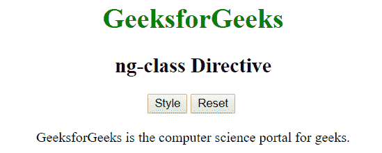

# AngularJS | ng 级指令

> 原文:[https://www.geeksforgeeks.org/angularjs-ng-class-directive/](https://www.geeksforgeeks.org/angularjs-ng-class-directive/)

AngularJS 中的 **ng 类指令**用于指定 HTML 元素上的 CSS 类。它用于动态绑定 HTML 元素上的类。如果 ng-class 指令中的表达式返回 true，则只添加该类，否则不添加。所有 HTML 元素都支持它。

**语法:**

```
<element ng-class="expression"> Contents... </element>
```

**示例 1:** 本示例使用 ng 类指令设置和重置 CSS 类。

```
<!DOCTYPE html>
<html>

<head>
    <title>ng-class Directive</title>

    <script src=
"https://ajax.googleapis.com/ajax/libs/angularjs/1.4.2/angular.min.js">
    </script>

    <style>
        .edit {
            color: green;
            font-size: 1.5em;
        }
    </style>
</head>

<body ng-app="" style="text-align:center">

    <h1 style="color:green">GeeksforGeeks</h1>
    <h2>ng-class Directive</h2>

    <div>
        <input type="button" ng-click="edit=true" value="Style" />
        <input type="button" ng-click="edit=false" value="Reset" />

        <br><br>

        <span ng-class="{true:'edit'}[edit]">
            GeeksforGeeks
        </span> 
        is the computer science portal for geeks.
    </div>
</body>

</html>                    
```

**输出:**
**点击按钮前:**

**点击风格按钮后:**


**示例 2:** 本示例使用 ng-class Directive 为类设置 CSS 样式。

```
<!DOCTYPE html>
<html>

<head>
    <title>ng-class Directive</title>

    <script src=
"https://ajax.googleapis.com/ajax/libs/angularjs/1.4.2/angular.min.js">
    </script>

    <style type="text/css">
        .index {
            color: white;
            background-color: green;
        }
    </style>
</head>

<body ng-app="app" style="padding:20px">

    <h1 style="color:green">GeeksforGeeks</h1>
    <h2>ng-class Directive</h2>

    <div ng-controller="geek">
        <table>
            <thead>
                <th>Select any sorting technique:</th>
                <tr ng-repeat="i in sort">
                    <td ng-class="{index:$index==row}" 
                            ng-click="sel($index)">
                        {{i.name}}
                    </td>
                </tr>
            </thead>
        </table>
    </div>

    <script>
        var app = angular.module("app", []);

        app.controller('geek', ['$scope', function ($scope) {
            $scope.sort = [
                { name: "Merge sort" }, 
                { name: "Quick sort" }, 
                { name: "Bubble sort" }
            ];
            $scope.sel = function (index) {
                $scope.row = index;
            };
        }]);
    </script>
</body>

</html>                    
```

**输出:**
**选元素前:**

**选元素后:**
