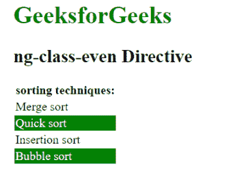

# AngularJS | ng 级偶数指令

> 原文:[https://www . geeksforgeeks . org/angular js-ng-class-even-direction/](https://www.geeksforgeeks.org/angularjs-ng-class-even-directive/)

AngularJS 中的 **ng 类偶指令**用于在 HTML 元素的每个偶外观上指定 CSS 类。它用于动态绑定每个偶数 HTML 元素上的类。如果 ng-class-even 指令中的表达式返回 true，则只添加该类，否则不添加。ng-repeat 指令是 ng-class-even 指令工作所必需的。所有 HTML 元素都支持它。

**语法:**

```ts
<element ng-class-even="expression"> Contents... </element>
```

**示例:**本示例使用 ng-class-even Directive 选择偶数元素并应用 CSS 属性。

```ts
<!DOCTYPE html>
<html>

<head>
    <title>ng-class-even Directive</title>

    <script src=
"https://ajax.googleapis.com/ajax/libs/angularjs/1.4.2/angular.min.js">
    </script>

    <style type="text/css">
        .index {
            color: white;
            background-color: green;
        }
    </style>
</head>

<body ng-app="app" style="padding:20px">

    <h1 style="color:green">GeeksforGeeks</h1>
    <h2>ng-class-even Directive</h2>

    <div ng-controller="geek">
        <table>
            <thead>
            <th>sorting techniques:</th>
            <tr ng-repeat="i in sort">
                <td ng-class-even="'index'">
                    {{i.name}}
                </td>
            </tr>
            </thead>
        </table>
    </div>

    <script>
        var app = angular.module("app", []);
        app.controller('geek', ['$scope', function ($scope) {
            $scope.sort = [
                { name: "Merge sort" }, 
                { name: "Quick sort" },
                { name: "Insertion sort" }, 
                { name: "Bubble sort" }
            ];     
        }]);
    </script>
</body>

</html>                    
```

**输出:**
