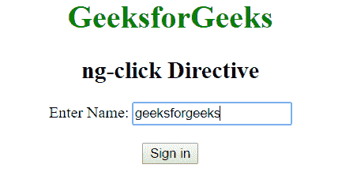
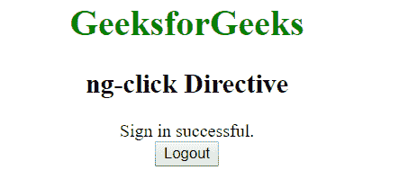

# 点击指令

> 原文:[https://www.geeksforgeeks.org/angularjs-ng-click-directive/](https://www.geeksforgeeks.org/angularjs-ng-click-directive/)

AngluarJS 中的 **ng-click 指令**用于在单击元素时应用自定义行为。它可以用来显示/隐藏某些元素，也可以在点击按钮时弹出警告。

**语法:**

```ts
<element ng-click="expression"> Contents... </element>
```

**示例 1:** 本示例使用 ng-click 指令在单击元素后显示警告消息。

```ts
<!DOCTYPE html>
<html>

<head>
    <title>ng-click Directive</title>

    <script src=
"https://ajax.googleapis.com/ajax/libs/angularjs/1.6.9/angular.min.js">
    </script>
</head>

<body ng-app="geek" style="text-align:center">

    <h1 style="color:green">GeeksforGeeks</h1>
    <h2>ng-click Directive</h2>

    <div ng-controller="app">
        <button>
            <a href="" ng-click="alert()">
                Click Here
            </a>
        </button>
    </div>

    <script>
        var app = angular.module("geek", []);
        app.controller('app', ['$scope', function ($app) {
            $app.alert = function () {
                alert("This is an example of ng-click");
            }
        }]);
    </script>
</body>

</html>
```

**输出:**
**点击按钮前:**

**点击按钮后:**


**示例 2:** 本示例使用 ng-click Directive 在单击元素后显示一些内容。

```ts
<!DOCTYPE html>
<html>

<head>
    <title>ng-click Directive</title>

    <script src=
"https://ajax.googleapis.com/ajax/libs/angularjs/1.6.9/angular.min.js">
    </script>
</head>

<body ng-app="" style="text-align:center">

    <h1 style="color:green">GeeksforGeeks</h1>
    <h2>ng-click Directive</h2>

    <form name="form">
        <div ng-hide="isShow">
            Enter Name:  <input type="text" required ng-model="Name" />

            <br><br>

            <input type="button" ng-disabled="form.$invalid"
                    ng-click="isShow = true" value="Sign in" />
        </div>

        <div ng-show="isShow">
            Sign in successful.<br>
            <input type="button" ng-click="isShow = false;Name=''"
                    value="Logout" />
        </div>
    </form>
</body>

</html>
```

**输出:**
**点击按钮前:**

**点击按钮后:**
