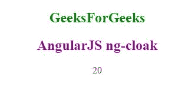

# 角形| ng-cloak 指令

> 原文:[https://www.geeksforgeeks.org/angularjs-ng-cloak-directive/](https://www.geeksforgeeks.org/angularjs-ng-cloak-directive/)

很多时候，当主应用程序启动时，AngularJS 应用程序会显示 HTML 文档的闪烁。这将显示相当长一段时间的 AngularJS 代码。ng-斗篷指令的使用是为了防止 AngularJS 中的元素被 web 浏览器以未完成、不完整、未编译和原始的形式呈现，而基本程序仍然处于加载的边缘。这基本上是为了停止不需要的**闪烁影响**，当程序加载时，它在开始时会多次显示。然后，未完成的数据只需保存并等待传入的数据。

**语法:**

```ts
<element ng-cloak> {{the piece of code}} </element>
```

**示例:**这个示例展示了 ng-斗篷指令的用法。

```ts
<!DOCTYPE html>
<html>
<script src=
"https://ajax.googleapis.com/ajax/libs/angularjs/1.6.9/angular.min.js">
</script>
    <head>
        <title>AngularJS | ng-cloak Directive</title>
    </head>

<div ng-app="">
            <body style = "text-align:center">
            <h2 style = "color:green">GeeksForGeeks</h2>
            <h2 style = "color:purple">AngularJS ng-cloak</h2>

            <p ng-cloak>{{ 10 + 10 }}</p>

</body>
</div>
</html>
```

**输出:**
**当我们加载代码:**


**即使我们不包含 ng-斗篷指令，这个例子也一定会在没有闪烁的情况下加载。但是这告诉我们如何在 HTML 元素中包含 ng-斗篷指令。**