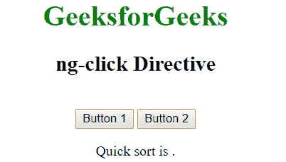
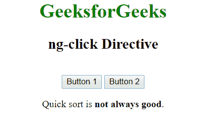

# 角度控制器指令

> 原文:[https://www . geeksforgeeks . org/angular js-ng-controller-direction/](https://www.geeksforgeeks.org/angularjs-ng-controller-directive/)

AngularJS 中的 **ng-controller 指令**用于向应用程序添加控制器。它可以用来添加方法、函数和变量，这些方法、函数和变量可以在点击等事件上被调用来执行某些操作。

**语法:**

```ts
<element ng-controller="expression"> Contents... </element>
```

其中**表述**是指控制器的名称。

**示例 1:** 本示例使用 ng-controller 指令显示输入元素。

```ts
<!DOCTYPE html>
<html>

<head>
    <title>ng-controller Directive</title>

    <script src=
"https://ajax.googleapis.com/ajax/libs/angularjs/1.4.2/angular.min.js">
    </script>
</head>

<body ng-app="app" style="text-align:center">

    <h1 style="color:green">GeeksforGeeks</h1>
    <h2>ng-controller Directive</h2><br>

    <div ng-controller="geek">
        Name: <input class="form-control" type="text"
                ng-model="name">
        <br><br>

        You entered: <b><span>{{name}}</span></b> 
    </div>

    <script>
        var app = angular.module('app', []);
        app.controller('geek', function ($scope) {
            $scope.name = "geeksforgeeks";
        });
    </script>
</body>

</html>
```

**输出:**


**示例 2:** 本示例使用 ng-controller Directive 在点击按钮后显示内容。

```ts
<!DOCTYPE html>
<html>

<head>
    <title>ng-controller Directive</title>

    <script src=
"https://ajax.googleapis.com/ajax/libs/angularjs/1.4.2/angular.min.js">
    </script>
</head>

<body ng-app="app" style="text-align:center">

    <h1 style="color:green">GeeksforGeeks</h1>
    <h2>ng-click Directive</h2>

    <div ng-controller="app">

        <button class="btn btn-default" ng-click="best()">
            Button 1
        </button>

        <button class="btn btn-primary" ng-click="notbest()">
            Button 2
        </button><br>

        <p>Quick sort is <b>{{res}}</b>.</p>
    </div>

    <script>
        var app = angular.module('app', []);
        app.controller('app', function ($scope) {
            $scope.best = function () {
                return $scope.res = "best";
            };
            $scope.notbest = function () {
                return $scope.res = "not always good";
            };
        });
    </script>
</body>

</html>
```

**输出:**
**点击前:**

**点击后按钮 2:**
