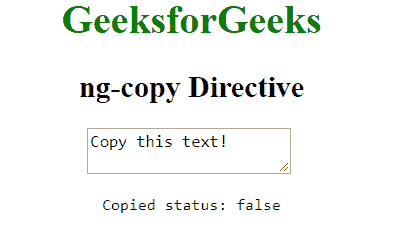
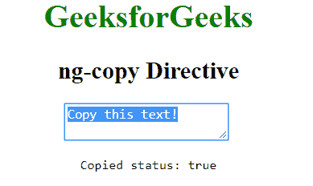

# AngularJS | ng-copy 指令

> 原文:[https://www.geeksforgeeks.org/angularjs-ng-copy-directive/](https://www.geeksforgeeks.org/angularjs-ng-copy-directive/)

AngularJS 中的 **ng-copy 指令**用于指定在输入文本字段中复制文本期间的自定义行为功能。当我们想要调用一个函数时，它可以被使用，当文本从输入域复制时，这个函数将被触发。所有输入元素都支持它。

**语法:**

```
<element ng-copy="expression"> Contents... </element>
```

其中**表达式**告诉复制元素时要做什么。

**示例:**本示例使用 ng-copy 指令在元素将复制时显示一条消息。

```
<!DOCTYPE html>
<html>

<head>
    <title>ng-copy Directive</title>

    <script src=
"https://ajax.googleapis.com/ajax/libs/angularjs/1.4.2/angular.min.js">
    </script>
</head>

<body ng-app  style="text-align:center">

    <h1 style="color:green">GeeksforGeeks</h1>
    <h2>ng-copy Directive</h2>

    <div ng-init="isCopy=false; copy='Copy this text!'">

        <textarea ng-copy="isCopy=true" ng-model="copy">
        </textarea>

        <br>

        <pre>Copied status: {{isCopy}}</pre>
    </div>
</body>

</html>
```

**输出:**
**前复制元素:**

**后复制元素:**
