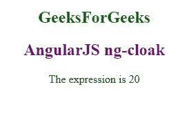

# angolajs | ng-CSP 指令

> 哎哎哎::1230【https://www . geeksforgeeks . org/angolajs-ng-CSP-指令/

像互联网上的任何其他东西一样，AngularJS 也不能幸免于攻击。然而，Angular 确实提供了来自基本安全漏洞的内置安全性。因此，AngularJS 被设计为与 HTTPS (SSL/TLS)、CSP 等安全措施兼容。

ng-CSP 指令用于更改 AngularJS 的安全策略，并在需要时打破 CSP(内容安全策略)的许多规则。它也不会运行任何 eval 函数，并且有助于停止向应用程序注入内联代码。当我们为操作系统(windows 应用程序)或浏览器(如谷歌 Chrome 扩展、火狐扩展等)开发应用程序时，这是必需的。

**语法:**

```
<element ng-csp="no-inline-style | no-unsafe-eval"> </element>
```

**参数说明:**

**no-unsafe-eval:** 内联样式和 eval 样式都不允许，因此该值可以保持为空。

**无内联样式:**值是否用分号(；)或保持为空，但两者都将表现为空值。在描述的两个值中，该值可以是其中的任何一个。

**示例:**此示例显示了 ng-csp 指令的用法。

```
<!DOCTYPE html>
<html>
<script src=
"https://ajax.googleapis.com/ajax/libs/angularjs/1.6.9/angular.min.js">
</script>
<body ng-app="" ng-csp>

<div ng-app="">
            <body style = "text-align:center">
            <h2 style = "color:green">GeeksForGeeks</h2>
            <h2 style = "color:purple">AngularJS ng-cloak</h2>

<p>The expression is {{ 10 + 10 }}</p>

</body>

</div>

<p></p>

</body>
</html>
```

**输出:**
**当我们加载代码:**


**通过 AngularJS 的表达式执行代码的方式，当我们使用 ng-app 指令时，它会发生变化。**

**区别不能仅仅通过看就知道，但是评估表达式的另一种方式的使用是被迫的。这大大增加了评估时间，大约增加了 30%。**