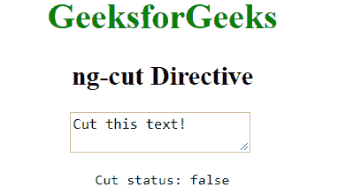

# 角度切割指令

> 原文:[https://www.geeksforgeeks.org/angularjs-ng-cut-directive/](https://www.geeksforgeeks.org/angularjs-ng-cut-directive/)

AngularJS 中的 **ng-cut 指令**用于指定输入字段中的文本被剪切时的自定义行为功能。当我们想要调用一个函数时，它可以被使用，当文本从输入域中被剪切时，这个函数将被触发。所有输入元素都支持它。

**语法:**

```
<element ng-cut="expression"> Contents... </element>
```

其中**表达式**告诉输入被切时该做什么。

**示例:**本示例使用 ng-cut Directive 在剪切输入文本元素时显示消息。

```
<!DOCTYPE html>
<html>

<head>
    <title>ng-cut Directive</title>

    <script src=
"https://ajax.googleapis.com/ajax/libs/angularjs/1.4.2/angular.min.js">
    </script>
</head>

<body ng-app  style="text-align:center">

    <h1 style="color:green">GeeksforGeeks</h1>
    <h2>ng-cut Directive</h2>

    <div ng-init="iscut=false;cut='Cut this text!'">
        <textarea ng-cut="iscut=true" ng-model="cut">
        </textarea>

        <br>

        <pre>Cut status: {{iscut}}</pre>
    </div>
</body>

</html>
```

**输出:**
**前切文字元素:**

**后切文字元素:**
