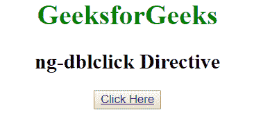
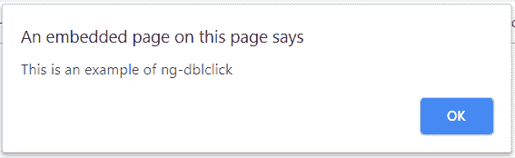
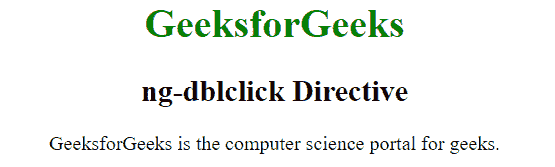
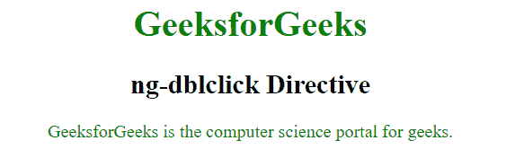

# angolajs | ng-dbl click 指令

> 哎哎哎:# t0]https://www . geeksforgeeks . org/angolajs-ng-dbl click-directive/

AngluarJS 中的 **ng-dblclick 指令**用于在双击元素时应用自定义行为。它可以用来显示或隐藏一些元素，或者它可以弹出警告或改变文本的颜色，当它被点击两次。
**语法:**

```
<element ng-dblclick="expression"> Content... </element>
```

**示例 1:** 本示例使用 ng-dblclick 指令，在双击按钮后显示报警信息。

## 超文本标记语言

```
<!DOCTYPE html>
<html>

<head>
    <title>ng-dblclick Directive</title>

    <script src=
"https://ajax.googleapis.com/ajax/libs/angularjs/1.6.9/angular.min.js">
    </script>
</head>

<body ng-app="geek" style="text-align:center">

    <h1 style="color:green">GeeksforGeeks</h1>

    <h2>ng-dblclick Directive</h2>

    <div ng-controller="app">
        <button>
            <a href="" ng-dblclick="alert()">
                Click Here
            </a>
        </button>
    </div>

    <script>
        var app = angular.module("geek", []);
        app.controller('app', ['$scope', function ($app) {
            $app.alert = function () {
                alert("This is an example of ng-dblclick");
            }
        }]);
    </script>
</body>

</html>
```

**输出:**
**双击前:**



**双击后:**



**示例 2:** 本示例在文本加倍点击后更改文本颜色。

## 超文本标记语言

```
<!DOCTYPE html>
<html>

<head>
    <title>ng-dblclick Directive</title>

    <script src=
"https://ajax.googleapis.com/ajax/libs/angularjs/1.6.9/angular.min.js">
    </script>

    <style type="text/css">
        .green {
            color: green;
        }
    </style>
</head>

<body ng-app style="text-align:center">

    <h1 style="color:green">GeeksforGeeks</h1>

    <h2>ng-dblclick Directive</h2>

    <div>
        <p ng-dblclick="col=!col" ng-class="{green:col}">
            GeeksforGeeks is the computer science
            portal for geeks.
        </p>

    </div>
</body>

</html>
```

**输出:**
**双击前:**



**双击后:**

