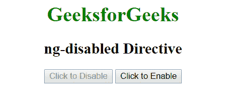

# 禁用角度指令

> 原文:[https://www . geeksforgeeks . org/angularjs-ng-disabled-direction/](https://www.geeksforgeeks.org/angularjs-ng-disabled-directive/)

AngularJS 中的 **ng-disabled 指令**用于启用或禁用 HTML 元素。如果 ng-disabled 属性中的表达式返回 true，则表单字段将被禁用，反之亦然。它通常应用于表单域(输入、选择、按钮等)。

**语法:**

```ts
<element ng-disabled="expression"> Contents... </element>
```

**示例 1:** 本示例使用 ng-disabled 指令禁用按钮。

## 超文本标记语言

```ts
<!DOCTYPE html>
<html>

<head>
    <title>ng-disabled Directive</title>

    <script src=
"https://ajax.googleapis.com/ajax/libs/angularjs/1.6.9/angular.min.js">
    </script>
</head>

<body ng-app="app" style="text-align:center">

    <h1 style="color:green">GeeksforGeeks</h1>

    <h2>ng-disabled Directive</h2>

    <div ng-controller="app" ng-init="disable=false">
        <button ng-click="geek(disable)" ng-disabled="disable">
            Click to Disable
        </button>

        <button ng-click="geek(disable)" ng-show="disable">
            Click to Enable
        </button>
    </div>

    <script>
        var app = angular.module("app", []);
        app.controller('app', ['$scope', function ($app) {
            $app.geek = function (disable) {
                $app.disable = !disable;
            }
        }]);
    </script>
</body>

</html>
```

**输出:**
**点击按钮前:**


**点击按钮后:**



**示例 2:** 本示例使用 ng-disabled 指令使用复选框启用和禁用按钮。

## 超文本标记语言

```ts
<!DOCTYPE html>
<html>

<head>
    <title>ng-disabled Directive</title>

    <script src=
"https://ajax.googleapis.com/ajax/libs/angularjs/1.6.9/angular.min.js">
    </script>
</head>

<body ng-app="app" style="text-align:center">

    <h1 style="color:green">GeeksforGeeks</h1>

    <h2>ng-disabled Directive</h2>

    <div ng-controller="geek">
        <h4>
            Check it
            <input type="checkbox" ng-model="check" />
        </h4>

        <button type="button" ng-disabled="!(check)">
            Click to submit
        </button>
    </div>

    <script>
        var app = angular.module("app", []);
        app.controller('geek', ['$scope', function ($scope) {
            $scope.disableClick = function (isDisabled) {
            $scope.isDisabled = !isDisabled;
            }
        }]);
    </script>
</body>

</html>
```

**输出:**
**点击按钮前:**


**点击按钮后:**


**支持的浏览器:**

*   谷歌 Chrome
*   微软边缘
*   火狐浏览器
*   歌剧
*   旅行队