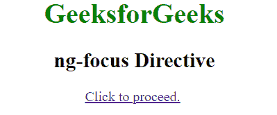
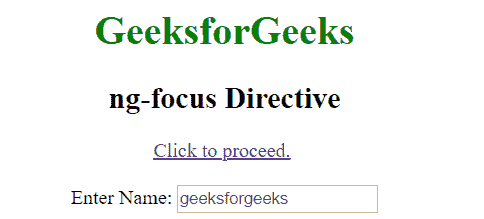
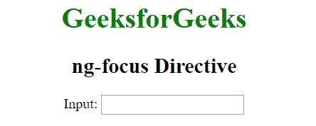
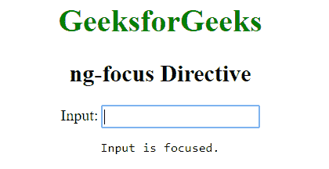

# 角度聚焦指令

> 原文:[https://www.geeksforgeeks.org/angularjs-ng-focus-directive/](https://www.geeksforgeeks.org/angularjs-ng-focus-directive/)

AngluarJS 中的 **ng-focus 指令**用于在元素被聚焦时应用自定义行为。它可以用来显示/隐藏某个元素，或者在元素被聚焦时弹出警告。由< a >、<输入>、<选择>和<文本区>元素支持。

**语法:**

```ts
<element ng-focus="expression"> Contents... </element>
```

其中**表达式**告诉当输入变得集中时该做什么。

**示例 1:** 本示例使用 ng-focus 指令显示文本区域字段。

## 超文本标记语言

```ts
<!DOCTYPE html>
<html>

<head>
    <title>ng-focus Directive</title>

    <script src=
"https://ajax.googleapis.com/ajax/libs/angularjs/1.6.9/angular.min.js">
    </script>
</head>

<body ng-app=""  style="text-align:center">

    <h1 style="color:green">GeeksforGeeks</h1>

    <h2>ng-focus Directive</h2>

    <a href="" ng-focus="isCheck=true">
        Click to proceed.
    </a>

    <br><br>

    <div class="row" ng-show="isCheck">
        Enter Name: <input type="text"
            ng-focus="isCheck=true"
            placeholder="geeksforgeeks" />
    </div>
</body>

</html>
```

**输出:**
**点击链接前:**



**点击链接后:**



**示例 2:** 本示例使用 ng-focus 指令在输入文本字段上显示焦点。

## 超文本标记语言

```ts
<!DOCTYPE html>
<html>

<head>
    <title>ng-focus Directive</title>

    <script src=
"https://ajax.googleapis.com/ajax/libs/angularjs/1.6.9/angular.min.js">
    </script>
</head>

<body ng-app="app" style="text-align:center;">

    <h1 style="color:green">GeeksforGeeks</h1>

    <h2>ng-focus Directive</h2>

    <div ng-controller="geek">
        Input: <input type="text" ng-focus="focused = true"
                ng-blur="focused = false" />

        <pre ng-show="focused">Input is focused.</pre>
    </div>

    <script>
        var app = angular.module("app", []);
        app.controller('geek', ['$scope', function ($scope) {
        }]);
    </script>
</body>

</html>
```

**输出:**
**之前点击文字区:**



**点击文本区后:**



**支持的浏览器:**

*   谷歌 Chrome
*   微软边缘
*   火狐浏览器
*   歌剧
*   狩猎