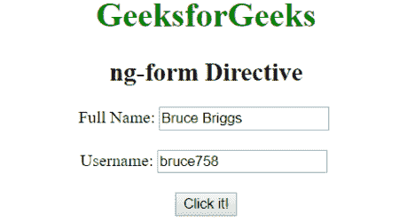
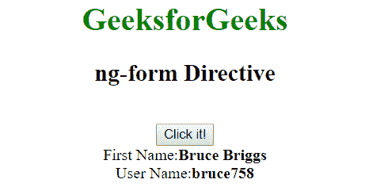
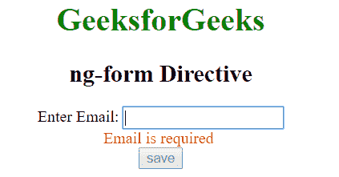
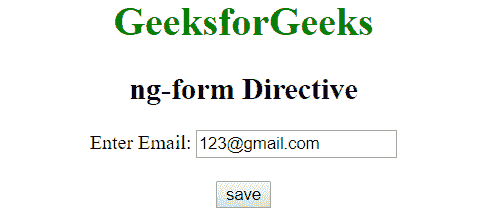

# AngularJS | ng 形式指令

> 原文:[https://www.geeksforgeeks.org/angularjs-ng-form-directive/](https://www.geeksforgeeks.org/angularjs-ng-form-directive/)

AngularJS 中的 **ng-form 指令**用于创建嵌套表单，即一个表单位于另一个表单的内部。它指定从 HTML 表单继承控件。它在表单指令中创建控件组，该指令可用于确定控件子组的有效性。

**语法:**

```ts
<ng-form [name="string"]> Contents... </ng-form>

```

**示例 1:** 本示例使用 ng-form Directive 隐藏输入文本字段并显示其内容。

```ts
<!DOCTYPE html>
<html>

<head>
    <title>ng-form Directive</title>

    <script src=
"https://ajax.googleapis.com/ajax/libs/angularjs/1.4.2/angular.min.js">
    </script> 
</head>

<body ng-app="" style="text-align:center">

    <h1 style="color:green;">GeeksforGeeks</h1>
    <h2 style="">ng-form Directive</h2>

    <div>
        <ng-form ng-hide="isDetail">
            Full Name:
            <input type="text" ng-model="fName">
            <br><br>
            Username:
            <input type="text" ng-model="uName">
            <br>
        </ng-form>
        <br>
        <input type="button" ng-click="isDetail=true"
                value="Click it!" />

        <div ng-show="isDetail">
            First Name:<b>{{fName}}</b><br />
            User Name:<b>{{uName}}</b><br />
        </div>
    </div>
</body>

</html>                    
```

**输出:**
**点击按钮前:**

**点击按钮后:**


**示例 2:** 本示例使用 ng-form Directive 验证电子邮件并保存。

```ts
<!DOCTYPE html>
<html>

<head>
    <title>ng-form Directive</title>

    <script src=
"https://ajax.googleapis.com/ajax/libs/angularjs/1.4.2/angular.min.js">
    </script> 
</head>

<body ng-app="" style="text-align:center">

    <h1 style="color:green;">GeeksforGeeks</h1>
    <h2 style="">ng-form Directive</h2>

    <div>
        <ng-form ng-submit="save(user)" name="myForm" novalidate>

            Enter Email:
            <input type="email" name="uname"
                required ng-model="user.userName"><br>

            <span style="color:red" ng-show="myForm.uname.$error.required
                    && myForm.uname.$dirty">Email is required</span>
            <br>

            <button ng-disabled="!myForm.$valid" type="submit">
                save
            </button>
        </ng-form>
    </div>
</body>

</html>                    
```

**输出:**
**无效输入:**

**有效输入:**
