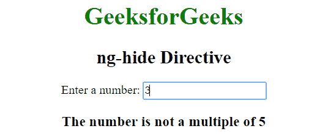
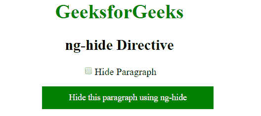
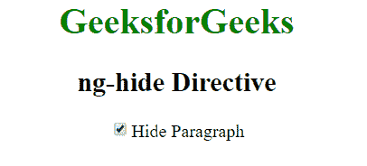

# 角度指令|隐藏指令

> 原文:[https://www.geeksforgeeks.org/angularjs-ng-hide-directive/](https://www.geeksforgeeks.org/angularjs-ng-hide-directive/)

AngluarJS 中的 **ng-hide 指令**用于显示或隐藏指定的 HTML 元素。如果在 ng-hide 属性中给出的表达式为真，则 HTML 元素隐藏。在 AngularJS 中，有一个名为 ng-hide 的预定义类，用于将显示设置为无。
**语法:**

```
 <element ng-hide="expression"> Contents... </element> 
```

**示例 1:** 本示例使用 ng-hide 指令显示输入的数字是否为 5 的倍数。

## 超文本标记语言

```
<!DOCTYPE html>
<html>

<head>
    <title>ng-hide Directive</title>

    <script src=
"https://ajax.googleapis.com/ajax/libs/angularjs/1.6.9/angular.min.js">
    </script>
</head>

<body ng-app="app" style="text-align:center">
    <div ng-controller="geek" ng-init="val=0">

        <h1 style="color:green">GeeksforGeeks</h1>

        <h2>ng-hide Directive</h2>

        Enter a number: <input type="text" ng-model="val"
                ng-keyup="check(val)">

        <div ng-hide="hide">
            <h3>
                The number is multiple of 5
            </h3>
        </div>

        <div ng-show="hide">
            <h3>
                The number is not a multiple of 5
            </h3>
        </div>
    </div>

    <script>
        var app = angular.module("app", []);
        app.controller('geek', ['$scope', function ($scope) {
            $scope.check = function (val) {
            $scope.hide = val % 5 == 0 ? false : true;
            };
        }]);
    </script>
</body>

</html>
```

**输出:**



**示例 2:** 本示例使用 ng-hide 指令隐藏内容。

## 超文本标记语言

```
<!DOCTYPE html>
<html>
    <script src="https://ajax.googleapis.com/ajax/libs/angularjs/
    1.6.9/angular.min.js"></script>
    <head>
        <title>ng-hide Directive</title>
    </head>
    <body>
        <div ng-app="app" ng-controller="geek"  style="text-align:center">
            <h1 style="color:green">GeeksforGeeks</h1>
            <h2>ng-hide Directive</h2>
            <input id="chbhide" type="checkbox" ng-model="hide" />
            <label for="chbhide">
                Hide Paragraph
            </label>
            <p ng-hide="hide" style="background: green; color: white;
            font-size: 14px; width:35%; padding: 10px;">
                Hide this paragraph using ng-hide
            </p>

        </div>
        <script>
            var myapp = angular.module("app", []);
            myapp.controller("geek", function ($scope) {
            $scope.hide = false;
            });
        </script>
    </body>
</html>
```

**输出:**
**点击前:**



**点击后:**

