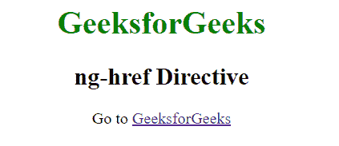

# angolajs | ng-href 指令

> 原文:[https://www.geeksforgeeks.org/angularjs-ng-href-directive/](https://www.geeksforgeeks.org/angularjs-ng-href-directive/)

当我们在 href 值中有一个角度表达式时，使用 ng-href 指令。如果使用 href 属性，那么问题是，如果在 AngularJS 用它的值替换表达式之前点击链接，那么它可能会转到错误的 URL，并且链接将被破坏，并且很可能返回 404 错误，而 ng-href 指令检查链接没有被破坏，即使链接是在 AngularJS 的代码评估之前点击的。

**语法:**

```
 <element ng-href="addr"> content ... </element> 
```

其中 **addr** 指包含角度表达式的字符串。

**示例:**

```
<!DOCTYPE html>
<html>
  <script src="https://ajax.googleapis.com/ajax/libs/angularjs/
   1.6.9/angular.min.js"></script>
  <body ng-app="" style="text-align:center">
    <div ng-init="url = 'https://www.geeksforgeeks.org/'">
    <h1 style="color:green">GeeksforGeeks</h1>
                <h2>ng-href Directive</h2>
    <p>Go to <a ng-href="{{url}}">GeeksforGeeks</a></p>
    </div>
  </body>
</html> 
```

**输出:**
