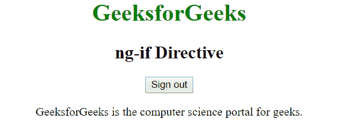

# AngularJS | ng-if 指令

> 原文:[https://www.geeksforgeeks.org/angularjs-ng-if-directive/](https://www.geeksforgeeks.org/angularjs-ng-if-directive/)

AngularJS 中的 **ng-if 指令**用于根据表达式移除或重新创建 HTML 元素的一部分。ng-if 不同于 ng-hide，因为它完全移除了 DOM 中的元素，而不仅仅是隐藏元素的显示。如果其中的表达式为假，则删除该元素，如果为真，则将该元素添加到 DOM 中。
**语法:**

```ts
<element ng-if="expression"> Contents... </element>
```

如果表达式返回 true，则创建元素；如果表达式返回 false，则完全移除元素。
**示例 1:** 本示例在点击按钮后更改内容。

## 超文本标记语言

```ts
<!DOCTYPE html>
<html>

<head>
    <title>ng-if Directive</title>

    <script src=
"https://ajax.googleapis.com/ajax/libs/angularjs/1.6.9/angular.min.js">
    </script>
</head>

<body ng-app="geek" style="text-align:center">

    <h1 style="color:green">
        GeeksforGeeks
    </h1>

    <h2>ng-if Directive</h2>

    <div ng-controller="app as vm">
        <div ng-if="!vm.IsShow">
            <input type="button" class="btn btn-primary"
                    ng-click="vm.IsShow=!vm.IsShow"
                    value="Sign in">

<p>Click to Sign in</p>

        </div>

        <div ng-if="vm.IsShow">
            <button class="btn btn-primary"
            ng-click="vm.IsShow=!vm.IsShow">
                Sign out
            </button>

<p>
                GeeksforGeeks is the computer
                science portal for geeks.
            </p>

        </div>
    </div>

    <script>
        var app = angular.module("geek", []);
        app.controller('app', ['$scope', function ($scope) {
            var vm = this;
        }]);
    </script>
</body>

</html>
```

**输出:**
**之前点击按钮:**


**点击按钮后:**



**示例 2:** 本示例在勾选复选框时添加了一些内容。

## 超文本标记语言

```ts
<!DOCTYPE html>
<html>

<head>
    <title>ng-if Directive</title>

    <script src=
"https://ajax.googleapis.com/ajax/libs/angularjs/1.6.9/angular.min.js">
    </script>

    <style>
        .geek {
            border: 1px solid black;
            padding: 10px;
            font-size: 15px;
            color: white;
            width: 50%;
            background: green;
        }
    </style>
</head>

<body ng-app style="padding:30px">

    <h1 style="color:green">
        GeeksforGeeks
    </h1>

    <h2>ng-if Directive</h2>

    <div>
        <input type="checkbox" ng-model="showDiv" />

        <label for="showDiv">
            Check it
        </label>

        <br><br>

        <div class="geek" ng-if="showDiv">
            GeeksforGeeks is the computer science
            portal for geeks.
        </div>
    </div>
</body>

</html>
```

**输出:**
**标记前勾选复选框:**


**勾选复选框后:**

