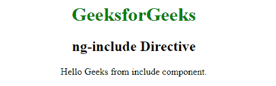
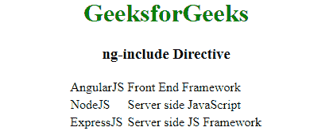

# AngularJS | ng-包括指令

> 原文:[https://www . geeksforgeeks . org/angularjs-ng-include-direction/](https://www.geeksforgeeks.org/angularjs-ng-include-directive/)

AngularJS 有一个内置指令，通过使用 ng-include 指令来包含来自其他 AngularJS 文件的功能。**“ng-include 指令”**的主要用途是在主 AngularJS 应用程序中获取、编译和包含一个外部 HTML 文件。这些节点作为子节点添加到主应用程序中。ng-include 属性的值也可以是返回文件名的表达式。所有 HTML 元素都支持这一点。

**语法:**

```
<element ng-include="filename" onload="expression" autoscroll="expression" >
Content...</element>

```

**注意:**这里的 onload 和 autoscroll 参数是可选的，onload 定义了一个表达式来评估包含的文件何时被加载，autoscroll 定义了包含的部分是否应该能够滚动到特定的视图中。

**Example:1**

*   **外部 HTML 文件:**将此文件保存为**child.html**。

    ```
    <!-- child.html -->
    <p>Hello Geeks from include component.</hp>
    <!--I am a partial, i don't require head and body tags.-->
    ```

    *   **代号:**

    ```
    <!DOCTYPE html> 
    <html> 

    <head> 
        <title>AngularJS | ng-include Directive</title> 
        <script src= 
    "https://ajax.googleapis.com/ajax/libs/angularjs/1.6.9/angular.min.js"> 
        </script> 
    </head> 

    <body ng-app="" style="text-align: center"> 
         <h1 style="color:green">GeeksforGeeks</h1> 
         <h3>ng-include Directive</h3>                             
         <div ng-include="'child.html'"></div>
    </body>

    </html>                     
    ```

    *   **输出:**
    

    **Example 2:**
    *   **外部 HTML 文件:**将此文件保存为 table.html。

        ```
        <!-- table.html -->
        <table>
          <tr ng-repeat="Subject in tutorials">
            <td>{{ Subject.Name }}</td>
            <td>{{ Subject.Description }}</td>
          </tr>
        </table>
        ```

    *   **代号:**

        ```
        <!DOCTYPE html>
        <html lang="en">
        <head>
            <meta charset="UTF-8">
            <meta name="viewport" content="width=device-width, initial-scale=1.0">
            <meta http-equiv="X-UA-Compatible" content="ie=edge">
            <title>AngularJS | ng-include Directive</title>
            <script src=
        "http://ajax.googleapis.com/ajax/libs/angularjs/1.4.8/angular.min.js">
            </script>  
        </head>
        <body ng-app="main-app">
            <center>
                <h1 style="color: green;">GeeksforGeeks</h1>
                 <h3>ng-include Directive</h3>
                <div ng-controller="AngularController">
                    <div ng-include="'table.html'"></div>
                </div>

        <script>
            var main_app = angular.module('main-app', []);
            main_app.controller('AngularController', function($scope) {
            $scope.tutorials =[
                    {Name: "AngularJS", Description : "Front End Framework"},
                    {Name: "NodeJS", Description : "Server side JavaScript"},
                    {Name: "ExpressJS", Description : "Server side JS Framework"}
                ];
            });
        </script>
        </body>
        </html>
        ```

    *   **输出:**
        