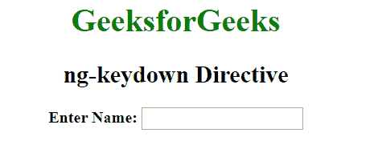
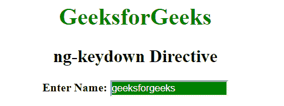

# 角度 JS | ng-keydown 指令

> 原文:[https://www . geeksforgeeks . org/angular js-ng-keydown-direction/](https://www.geeksforgeeks.org/angularjs-ng-keydown-directive/)

AngluarJS 中的**ng-keything 指令**用于对按键事件应用自定义行为。支持<输入>、<选择>和<文本区>元素。

**语法:**

```
 <element ng-keydown="expression"> Contents... </element>
```

**示例:**本示例使用 ng-keything direction 在按下按钮后更改背景颜色。

```
<!DOCTYPE html>
<html>

<head>
    <title>ng-keydown Directive</title>

    <script src=
"https://ajax.googleapis.com/ajax/libs/angularjs/1.6.9/angular.min.js">
    </script>

    <style type="text/css">
        .keyDown {
            background-color: green;
            color: white;
        }
        .keyUp {
            background-color: white;
        }
    </style>
</head>

<body ng-app style="text-align:center">

    <h1 style="color:green">
        GeeksforGeeks
    </h1>

    <h2>ng-keydown Directive</h2>

    <div>
        <b>Enter Name: </b><input type="text"
        ng-model="searchValue" ng-keydown="keyDown=true"
        ng-keyup="keyDown=false" ng-class=
        "{true:'keyDown', false:'keyUp'}[keyDown]" />

        <br>
    </div>
</body>

</html>
```

**输出:**
**按下按钮前:**

**按下按钮后:**
