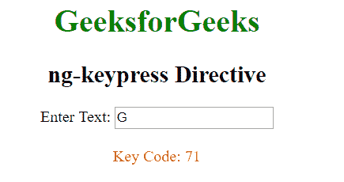

# angolajs | ng-keypress 指令

> 哎哎哎:# t0]https://www . geeksforgeeks . org/angolajs-ng-key press-directive/

AngluarJS 中的 **ng 按键指令**用于对按键事件应用自定义行为。支持<输入>、<选择>和<文本区>元素。

**语法:**

```ts
<element ng-keypress="expression"> Contents... </element>
```

其中**表达式**告诉按键时要做什么。

**示例:**本示例使用 ng-keypress 指令显示键值。

```ts
<!DOCTYPE html>
<html>

<head>
    <title>ng-keypress Directive</title>

    <script src=
"https://ajax.googleapis.com/ajax/libs/angularjs/1.6.9/angular.min.js">
    </script>

    <script type="text/javascript">
        var app = angular.module('app', []);
        app.controller('geek', function ($scope) {
            $scope.getkeys = function (event) {
                $scope.keyval = event.keyCode;
            }
        });
    </script>
</head>

<body style="text-align:center">
    <div ng-app="app" ng-controller="geek">
        <h1 style="color:green">
            GeeksforGeeks
        </h1>

        <h2>ng-keypress Directive</h2>

        Enter Text: <input type="text"
                ng-keypress="getkeys($event)" >

        <br><br>

        <span style="color:Red">
            Key Code: {{keyval}}
        </span>
    </div>
</body>

</html>
```

**输出:**
