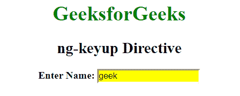
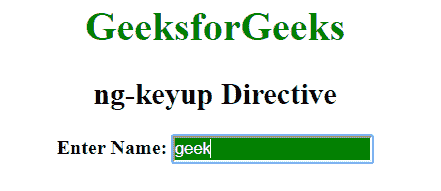

# 角联| ng-keyup 指令

> 原文:[https://www.geeksforgeeks.org/angularjs-ng-keyup-directive/](https://www.geeksforgeeks.org/angularjs-ng-keyup-directive/)

AngluarJS 中的 **ng-keyup 指令**用于对 keyup 事件应用自定义行为。支持<输入>、<选择>和<文本区>元素。

**语法:**

```ts
<element ng-keyup="expression"> Contents... </element>
```

**示例:**本示例使用 ng-keyup direction 更改上下键按钮时的背景颜色。

## 超文本标记语言

```ts
<!DOCTYPE html>
<html>

<head>
    <title>ng-keyup Directive</title>

    <script src=
"https://ajax.googleapis.com/ajax/libs/angularjs/1.6.9/angular.min.js">
    </script>

    <style type="text/css">
        .keyDown {
            background-color: yellow;
            color: black;
        }
        .keyUp {
            background-color: green;
            color:white;
        }
    </style>
</head>

<body ng-app style="text-align:center">

    <h1 style="color:green">
        GeeksforGeeks
    </h1>

    <h2>ng-keyup Directive</h2>

    <div>
        <b>Enter Name: </b><input type="text"
        ng-model="searchValue" ng-keydown="keyDown=true"
        ng-keyup="keyDown=false" ng-class=
        "{true:'keyDown', false:'keyUp'}[keyDown]"/>

        <br>
    </div>
</body>

</html>
```

**输出:**
**当按键按下时:**



**钥匙打开时:**



**支持的浏览器:**

*   谷歌 Chrome
*   微软边缘
*   火狐浏览器
*   歌剧
*   旅行队