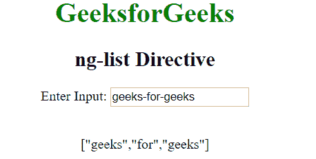

# AngularJs | ng-list 指令

> 原文:[https://www.geeksforgeeks.org/angularjs-ng-list-directive/](https://www.geeksforgeeks.org/angularjs-ng-list-directive/)

AngularJS 中的 **ng-list 指令**用于分隔输入字符串，并使用分隔符将其转换为字符串数组。默认情况下，逗号用作默认分隔符。但是任何自定义分隔符都可以用作 ng-list 指令的值。

**语法:**

```
 <element ng-list="delimiter"> Contents... </element> 
```

ng-list 的值指定用于分隔输入字符串的分隔符。

**示例:**本示例使用 ng-list 指令将输入转换为数组。

## 超文本标记语言

```
<!DOCTYPE html>
<html>

<head>
    <title>ng-list Directive</title>

    <script src=
"https://ajax.googleapis.com/ajax/libs/angularjs/1.6.9/angular.min.js">
    </script>
</head>

<body ng-app="app" style="text-align:center">

    <h1 style="color:green">GeeksforGeeks</h1>

    <h2>ng-list Directive</h2>

    <div ng-controller="geek">

<p>Enter Input: <input type="text"
                ng-model="list" ng-list="-">
        </p>

        {{list}}
    </div>

    <script>
        var app = angular.module("app", []);
        app.controller('geek', ['$scope', function ($scope) {
            $scope.list = [];
        }]);
    </script>
</body>

</html>
```

**输出:**



**支持的浏览器:**

*   谷歌 Chrome
*   微软边缘
*   火狐浏览器
*   歌剧
*   旅行队