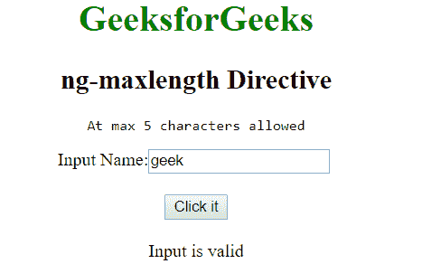

# 角度 JS | ng-maxlength 指令

> 原文:[https://www . geeksforgeeks . org/angular js-ng-maxlength-directive/](https://www.geeksforgeeks.org/angularjs-ng-maxlength-directive/)

AngularJS 中的 **ng-maxlength 指令**用于设置输入字段的最大长度，即它增加了对输入字段的限制。它不同于 HTML 中的 maxlength 属性，因为前者防止用户超出限制，而后者则不会。如果输入超出限制，将使表单无效。

**语法:**

```
 <element ng-maxlength="expression"> Contents... </element> 
```

其中**表达式**是表示输入有效的最大极限的数字。

**示例:**本示例使用 ng-maxlength 指令检查字符串的最大长度。

```
<!DOCTYPE html>
<html>

<head>
    <title>ng-maxlength Directive</title>

    <script src=
"https://ajax.googleapis.com/ajax/libs/angularjs/1.6.9/angular.min.js">
    </script>
</head>

<body style="text-align: center">

    <h1 style="color:green">GeeksforGeeks</h1>

    <h2>ng-maxlength Directive</h2>

    <div ng-app="app" ng-controller="geek">
          <form name="maxlen" novalidate ng-submit=
                        "maxlen.$valid &&maxlength()">
              <pre>Atmax 5 characters required</pre>

              Input: <input type="text" name="code" ng-model="txt"
                        ng-maxlength="5" required />
             <br><br>

             <button type="submit">Click it</button>

             <br><br>

             <span>{{msg}}</span>
         </form>
    </div>

    <script>
        var app = angular.module('app', []);
        app.controller('geek', function ($scope) {
            $scope.maxlength = function () {
                $scope.msg = "Input is valid";
            };
        });
    </script>
</body>

</html>
```

**输出:**
**点击按钮前:**

**点击按钮后:**
