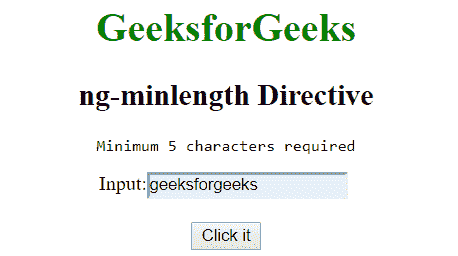
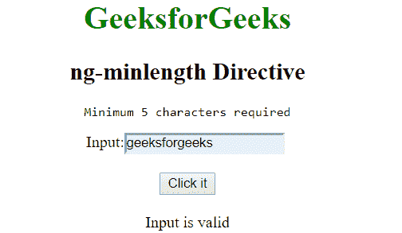

# 角度 JS | ng-minlength 指令

> 哎哎哎:# t0]https://www . geeksforgeeks . org/angolajs-ng-minlength-directive/

AngularJS 中的 **ng-minlength 指令**用于设置输入字段的最小长度，即增加了对输入字段的限制。它不同于 HTML 中的 minlength 属性，因为前者防止用户输入小于指定的限制，而后者则不会。如果输入的输入小于指定的限制，则表单无效。

**语法:**

```ts
<element ng-minlength="expression"> content ... </element> 
```

其中**表达式**是表示输入无效的最小极限的数字。

**示例:**本示例使用 ng-minlength 指令设置字符串的最小长度。

```ts
<!DOCTYPE html>
<html>

<head>
    <title>ng-minlength Directive</title>

    <script src=
"https://ajax.googleapis.com/ajax/libs/angularjs/1.6.9/angular.min.js">
    </script>
</head>

<body style="text-align:center">

    <h1 style="color:green">GeeksforGeeks</h1>

    <h2>ng-minlength Directive</h2>

    <div ng-app="app" ng-controller="geek">
        <form name="minlength" novalidate ng-submit
                    ="minlength.$valid &&check()">

            <pre>Minimum 5 characters required</pre>

            Input: <input type="text" name="code" ng-model="txtpin"
                    ng-minlength="5" required />

            <br><br>

            <button type="submit">Click it</button>

            <br><br>

            <span>{{msg}}</span>
        </form>
    </div>

    <script>
        var app = angular.module('app', []);
        app.controller('geek', function ($scope) {
            $scope.check = function () {
                $scope.msg = "Input is valid";
            };
        });
    </script>
</body>

</html>
```

**输出:**
**点击按钮前:**

**点击按钮后:**
